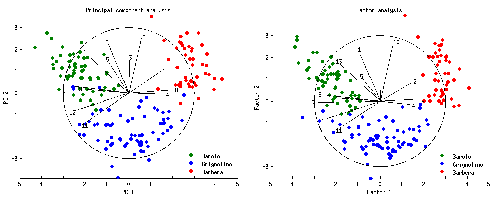

# Exploratory Multivariate Analysis with Factorial Methods

**Principal Component Analysis (PCA), Correspondence Analysis (CA), and Multiple Correspondence Analysis (MCA)**

## 1. About

This notebook presents three applied case studies illustrating the use of factorial methods for exploratory multivariate data analysis.

Rather than treating dimensionality reduction techniques as black-box tools, the objective is to understand what structures these methods uncover, how inertia is decomposed, and how geometric representations help interpret complex datasets.

The notebook focuses on:

- quantitative data (PCA)
- contingency tables (CA)
- categorical data via disjunctive coding (MCA)

with a strong emphasis on theoretical validation, geometric interpretation, and practical diagnostics (inertia, contributions, cos²).

## 2. Case Study Overview

### Case Study 1 - Climate Typology of European Cities (PCA)

We apply Principal Component Analysis (PCA) to monthly temperature data for European cities.

**Goals:**

- identify dominant climatic gradients
- interpret axes in terms of average temperature level and seasonal variability
- validate results using supplementary quantitative and qualitative variables (latitude, amplitude, geographic area)
- assess representation quality via contributions and cos²

This case illustrates how PCA reveals latent climatic structures using continuous variables only.

### Case Study 2 - Olympic Disciplines × Countries (Correspondence Analysis)

We use Correspondence Analysis (CA) on a discipline × country medal contingency table from multiple Olympic Games.

**Goals:**

- explore the association structure between sports and countries
- study inertia decomposition and its link with the χ² statistic
- analyze barycenters, orthogonality, and variance properties
- identify dominant disciplines and countries via row and column contributions
- interpret axes in terms of endurance vs power/technical specialization

This case emphasizes the geometric foundations of CA and its direct connection to independence testing.

### Case Study 3 - Bank Client Profiling (Multiple Correspondence Analysis)

We apply Multiple Correspondence Analysis (MCA) to categorical socio-economic survey data from banking clients.

**Goals:**

- analyze profiles based on age, gender, credit behavior, and financial status
- detect rare and dominant modalities
- interpret axes using category contributions
- construct a typology of clients based on latent socio-economic patterns

This case highlights MCA as the natural extension of CA to categorical datasets encoded via disjunctive tables.

## 3. Methodological Focus

Across the three case studies, the notebook systematically addresses:

- inertia and variance decomposition
- eigenvalues and dimensionality selection
- contributions of individuals, variables, and categories
- cos² as a measure of representation quality
- barycentric properties of factorial projections
- interpretation of axes through geometry rather than heuristics

All results are explicitly verified using both theoretical identities and numerical checks.

---

## Core takeaways

- Factorial methods provide interpretable low-dimensional representations of complex data.
- PCA, CA, and MCA address fundamentally different data structures but share a common geometric framework.
- Inertia, contributions, and cos² are essential tools for rigorous interpretation.
- Supplementary variables and individuals allow a posteriori validation without biasing the analysis.
- Simple geometric reasoning often explains results more clearly than complex models.

## Dependencies

- numpy
- pandas
- matplotlib
- seaborn
- scikit-learn
- mca (for CA and MCA)

---
***Alexandre Mathias DONNAT, Sr***