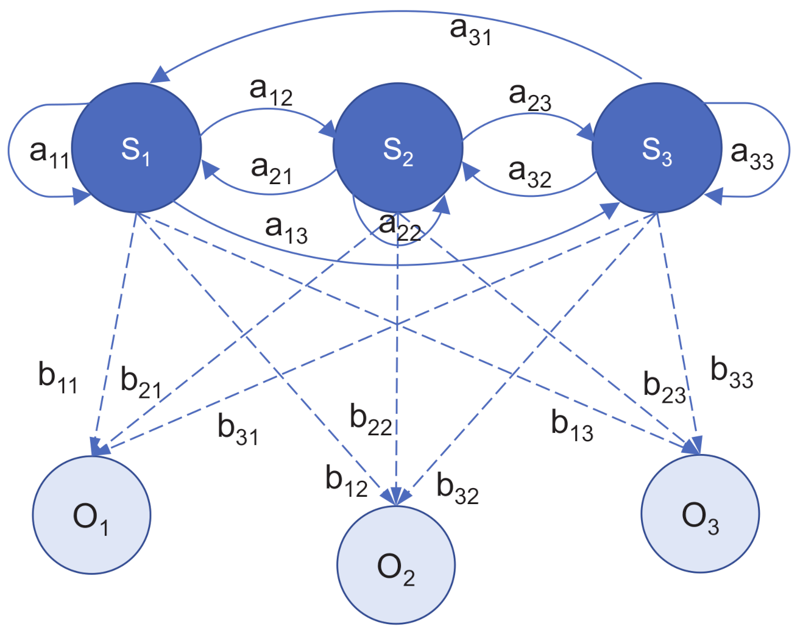

# Hidden Markov Chains
**Discrete Sequential Modeling, Generative Text Simulation & Likelihood-Based Language Recognition**



## About
This notebook presents a structured and mathematically grounded exploration of discrete-time Markov chains applied to language modeling.

The objective is to understand how simple probabilistic transition structures can be used to both generate sequences (synthetic words and sentences) and evaluate the likelihood of observed data under different models.

Rather than focusing on performance or realism, the emphasis is placed on:

* the internal consistency of probabilistic models,
* the link between transition structures and generated sequences,
* and the interpretation of likelihood as a scoring mechanism.

This framework serves as a conceptual bridge toward Hidden Markov Models (HMMs) and more advanced sequential models used in machine learning, NLP, and quantitative modeling.

## Mathematical Framework
A Markov chain is defined as a stochastic process $(X_t)_{t \geq 0}$ satisfying the Markov property:

$$P(X_{t+1}=j \mid X_t=i, X_{t-1}, \ldots) = P(X_{t+1}=j \mid X_t=i)$$

The model is fully characterized by a transition matrix:

$$A = (a_{ij}), \quad a_{ij} = P(X_{t+1}=j \mid X_t=i)$$

with:

$$\sum_j a_{ij} = 1 \quad \forall i$$

### Sequence generation
A sequence is generated by iteratively sampling:

$$X_{t+1} \sim \text{Categorical}(A_{X_t, \cdot})$$

This is implemented using the cumulative distribution function:

$$F_j = \sum_{k=1}^j a_{ik}$$

and a uniform draw $u \sim \mathcal{U}[0,1]$, selecting the smallest $j$ such that:

$$F_j \geq u$$

### Likelihood of a sequence
Given a sequence $(x_1, \ldots, x_T)$, its likelihood under the model is:

$$P(x_1, \ldots, x_T) = \prod_{t=1}^{T-1} P(x_{t+1} \mid x_t)$$

In practice, log-likelihood is used for numerical stability:

$$\log P = \sum_{t=1}^{T-1} \log P(x_{t+1} \mid x_t)$$

## Structure of the Notebook

### Part I: Markov Chain for Language Modeling

The model considers a discrete state space of size 28:

* state 1: beginning of word (-)
* states 2–27: letters a–z
* state 28: end of word (+)

A transition matrix learned from bigram statistics defines the probability of moving from one character to the next.

Main methodological steps:

1. Loading and interpreting the transition matrix: The entry $A_{ij}$ represents the probability of transitioning from character $i$ to character $j$.

2. Understanding boundary states: The first row models the distribution of initial letters. The last column captures the probability of terminating a word.

3. Generation of words: A sequence is generated starting from the initial state until reaching the terminal state. State transitions are sampled according to the transition probabilities, producing synthetic words consistent with the learned distribution.

4. Mapping states to characters: A dictionary is used to translate numerical states into readable text.

Insight: The model captures local dependencies between letters but has no understanding of semantics or long-range structure. Generated words resemble plausible patterns without forming meaningful language.

### Part II: Sentence Generation via Extended State Space

The model is extended to include a new state (29) representing the end of a sentence (.), introducing a hierarchical structure: words within sentences.

Modified transition dynamics:

From end-of-word state (+):

$$P(+ \to -) = 0.9, \quad P(+ \to .) = 0.1$$

The sentence generation process becomes a concatenation of words, terminating probabilistically.

Main steps:

1. Modification of the transition matrix: The row corresponding to the end-of-word state is redefined to enforce valid transitions between words.

2. Ensuring structural consistency: Transitions such as $+ \to -$ are explicitly enforced to match the encoded representation of sequences.

3. Generation of sentences: Sequences are generated until reaching the absorbing terminal state ".".

Insight: Introducing structure at the state level enables hierarchical generation (word → sentence) while maintaining a simple Markovian framework.

### Part III: Language Recognition via Likelihood

Two models are considered:

* English bigram model
* French bigram model

The goal is to determine which model better explains a given sentence.

Sequence encoding: A sentence such as "to be or not to be" is transformed into:

```
-to+-be+-or+-not+-to+-be+.
```

This encoding ensures that all transitions, including word boundaries and sentence termination, are explicitly modeled.

Likelihood computation: The likelihood is computed as the product of all transition probabilities along the sequence. To avoid numerical underflow, log-likelihood is used:

$$\log P = \sum \log a_{ij}$$

Model comparison: Given two models $M_1$ and $M_2$, the preferred model is:

$$\arg\max_M \log P(\text{sequence} \mid M)$$

Insight: This approach implements a simple generative classifier. The model does not understand language but assigns higher likelihood to sequences consistent with its learned transition structure.

## Methodological perspective

In this notebook I emphasize the importance of consistency between model structure and data representation, the distinction between generation and evaluation in probabilistic models, the role of likelihood as a principled scoring mechanism, the limitations of local dependency models for capturing complex linguistic structure.

Simple models require careful alignment between state definitions, transition dynamics, and sequence encoding. Failure to ensure this consistency leads to degenerate results (e.g., zero likelihood due to impossible transitions), highlighting the importance of structural validation.

## Dependencies

* numpy
---
***Alexandre Mathias DONNAT, Sr***
