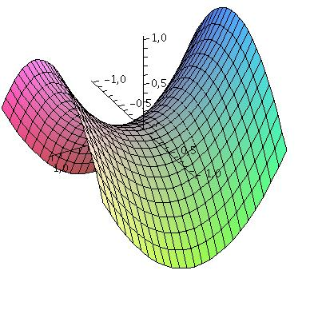

# Convex Analysis & Lagrangian Duality, KKT - SVM Practice

## 1. About

This notebook provides an experimental and theoretical study of Lagrangian duality through the soft-margin Support Vector Machine (SVM) problem.

The objective is not only to implement SVM optimization, but to understand:

- The primal formulation with hinge loss
- The constrained formulation with slack variables
- The construction of the Lagrangian
- The derivation of the dual problem
- The relationship between primal and dual solutions
- The role of Karush–Kuhn–Tucker (KKT) conditions
- Weak duality and duality gap

The Iris dataset is used to connect theoretical derivations with numerical experiments.

## 2. Learning Problem Setup

We consider a binary classification problem with labels:

$$y \in \{-1, +1\}$$

Each observation is a feature vector:

$$x \in \mathbb{R}^d$$

The soft-margin SVM primal problem is:

$$\min_w \; C \sum_i \max(0, 1 - y_i x_i^T w) + \frac{1}{2} \|w\|^2$$

This formulation:

- Maximizes the margin
- Penalizes margin violations via hinge loss
- Produces a convex but non-differentiable objective

An equivalent constrained formulation introduces slack variables $\xi_i \geq 0$.

## 3. From Primal to Dual

Using Lagrangian duality, we derive the dual function:

$$D(\phi) = -\frac{1}{2} \left\| \sum_i \phi_i y_i x_i \right\|^2 + \sum_i \phi_i$$

with constraints:

$$0 \leq \phi_i \leq C$$

The dual problem is a concave quadratic maximization problem over a box constraint. This formulation reveals:

- The Gram matrix structure $Q_{ij} = y_i y_j x_i^T x_j$
- The quadratic nature of the dual objective
- The connection between dual variables and support vectors

## 4. Optimization Methods

Two optimization strategies are implemented:

### 4.1 Primal — Stochastic Gradient Descent

We minimize the primal objective using SGD:

$$w \leftarrow w - \eta_k \left( w + C \nabla F_i(w) \right)$$

This highlights:

- The role of hinge loss gradients
- The effect of step-size scheduling
- Practical convergence behavior

### 4.2 Dual — Projected Gradient Ascent

We maximize the dual objective using projected gradient ascent:

$$\phi \leftarrow \Pi_{[0,C]} \left( \phi + \gamma \nabla q(\phi) \right)$$

with step size:

$$\gamma \leq \frac{1}{\lambda_{\max}(Q)}$$

This guarantees convergence under Lipschitz continuity of the gradient.

## 5. KKT Conditions and Duality Gap

The KKT conditions give the link between primal and dual solutions:

$$w^* = \sum_i \phi_i^* y_i x_i$$

We verify numerically that:

- The reconstructed $w_{\text{KKT}}$ matches the dual solution
- The duality gap $\text{Primal}(w_{\text{KKT}}) - \text{Dual}(\phi^*)$ is approximately zero

This confirms near-optimality of the dual solution.

Weak duality ensures:

$$\text{Dual}(\phi) \leq \text{Primal}(w^*)$$

Strong duality holds here because the problem is convex and satisfies Slater's condition.

## 6. Structure of the Dual Solution

The dual solution $\phi^*$ exhibits fundamental SVM properties:

**Sparsity:** many $\phi_i^* = 0$
- Only a subset of points (support vectors) influence the classifier
- Coefficients often lie on the boundaries $(0 \text{ or } C)$

**Interpretation:**

- $\phi_i^* = 0$ → point well classified, outside margin
- $0 < \phi_i^* < C$ → point exactly on the margin
- $\phi_i^* = C$ → margin violation (soft-margin regime)

This sparse structure explains why SVM solutions depend only on a subset of training points.

## 7. Key Takeaways

- The SVM hinge-loss formulation is convex but non-differentiable
- Lagrangian duality transforms the constrained primal into a quadratic concave dual problem
- Dual variables directly identify support vectors
- KKT conditions provide an explicit link between primal and dual solutions
- The duality gap is a practical optimality certificate
- Projected gradient ascent efficiently solves the dual problem
- Primal SGD may require careful tuning to converge reliably

## 8. Dependencies

- `numpy`
- `scikit-learn`
