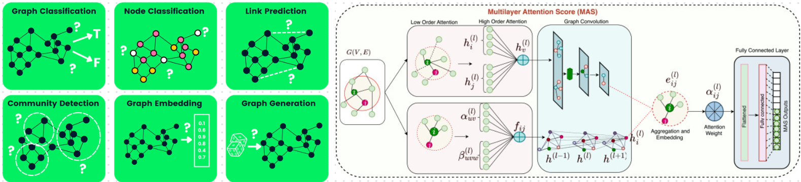

# From Graph Structures to Graph Neural Networks - Practice & Experiments

**Node Classification, Graph Property Prediction with GCN**

### About

This repository presents a structured exploration of Graph Neural Networks (GNNs) using PyTorch Geometric and Open Graph Benchmark (OGB) datasets.

The objective is not only to implement graph-based models, but to understand how learning operates on non-Euclidean structured data, where samples are no longer independent and relationships between entities play a central role.

Rather than treating GNNs as black-box architectures, this work emphasizes:

* The role of graph structure in learning
* The difference between node-level and graph-level prediction
* The impact of message passing on feature propagation
* The importance of normalization in deep GNNs
* The role of pooling in constructing graph representations
* The limitations of vanilla GCN architectures on complex tasks

Two main tasks are studied:

* Node Property Prediction (ogbn-arxiv)
* Graph Property Prediction (ogbg-molhiv)

### Mathematical Framework

A graph is defined as:

$$G = (V, E)$$

where:

* $V$ = set of nodes
* $E$ = set of edges

Each node has features:

$$X \in \mathbb{R}^{N \times d}$$

The goal is to learn a function:

$$f(G, X) \to Y$$

### Graph Convolutional Networks (GCN)

A GCN layer performs:

$$H^{(l+1)} = \sigma(\hat{A} H^{(l)} W^{(l)})$$

where:

* $\hat{A}$ = normalized adjacency matrix
* $H^{(l)}$ = node embeddings at layer $l$
* $W^{(l)}$ = learnable weights

### Node Property Prediction

Each node is classified individually.

#### Pipeline

$$X \to \text{GCN layers} \to \text{Node embeddings} \to \text{Classifier}$$

#### Key properties

* Nodes are not independent
* Each node aggregates information from neighbors
* The receptive field grows with depth

#### Observations

* GCN captures structural dependencies
* Training is stable with BatchNorm
* Deep GCN without normalization becomes unstable
* Over-smoothing appears with increasing depth

### Graph Property Prediction

Each graph is assigned a label.

#### Pipeline

$$\text{Nodes} \to \text{GCN} \to \text{Node embeddings} \to \text{Pooling} \to \text{Graph embedding} \to \text{Prediction}$$

#### Global Pooling

Aggregation function:

$$z_G = \text{POOL}(H)$$

Examples:

Mean pooling:
$$z_G = \frac{1}{N} \sum_{i=1}^{N} h_i$$

Sum pooling:
$$z_G = \sum_{i=1}^{N} h_i$$

#### Key Insight

Pooling defines how local information becomes global representation.

### Parameterization & Complexity

GCN complexity depends on:

* Number of layers $L$
* Hidden dimension $d$
* Graph size $|E|$

Cost: $O(|E| \cdot d)$

### Evaluation Metrics

#### Node Classification (ogbn-arxiv)

* Accuracy

#### Graph Classification (ogbg-molhiv)

* ROC-AUC

These metrics capture:

* Generalization ability
* Sensitivity to class imbalance
* Model robustness

### Experiments

#### Node Classification

Models compared:

* GCN (with BatchNorm)
* Deep GCN without BatchNorm

Observations:

* BatchNorm stabilizes training
* Deep GCN without normalization leads to:
    * exploding loss
    * unstable gradients
    * poor generalization

#### Graph Classification

Model: GCN + global mean pooling

Observations:

* Moderate performance (~65–70% ROC-AUC)
* Evidence of overfitting: higher train score than validation
* Limited expressiveness of vanilla GCN

### Optional Extensions

#### Graph Attention Networks (GAT)

Introduce attention mechanism:

$$\alpha_{ij} = \text{softmax}(a(h_i, h_j))$$

* Learn importance of neighbors
* More expressive than GCN

#### Alternative Pooling Strategies

* Mean pooling: average behavior
* Sum pooling: magnitude-sensitive
* Max pooling: dominant features

These choices impact graph representation quality.

### Repository Structure

#### Step 1 – Graph Data Handling

Focus:

* PyG data structures
* Graph representation
* Feature and edge encoding

#### Step 2 – Node Classification (GCN)

Focus:

* Message passing
* Node embeddings
* Training on graph structure

#### Step 3 – Deep GCN & Stability

Focus:

* Effect of depth
* Role of BatchNorm
* Training instability analysis

#### Step 4 – Graph Classification

Focus:

* Mini-batching graphs
* Pooling mechanisms
* Graph-level prediction

### Methodological Perspective

This work emphasizes:

* Learning on structured data vs tabular data
* The importance of relational inductive bias
* The role of architecture design in stability
* The transition from local (node) to global (graph) representations
* The limits of simple GNNs on complex real-world tasks

The goal is not only performance, but understanding how information propagates in graphs and how representation is built.

### Dependencies

* numpy
* pandas
* torch
* torch_geometric
* ogb
* tqdm

---
***Alexandre Mathías DONNAT***
