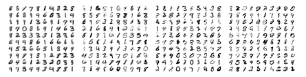

# Wasserstein GAN with Gradient Penalty

**DCGAN Architecture for MNIST Digit Generation (PyTorch Implementation)**

 

## About

This notebook implements a Wasserstein Generative Adversarial Network with Gradient Penalty (WGAN-GP) to generate handwritten digits from the MNIST dataset.

Unlike classical GANs that minimize a Jensen–Shannon divergence through a discriminator with sigmoid output, this model:

- Uses a critic instead of a discriminator
- Optimizes the Wasserstein distance
- Enforces the 1-Lipschitz constraint via gradient penalty

The objective is to understand:

- Why GAN training is unstable
- How Wasserstein loss stabilizes optimization
- Why Lipschitz regularization is required
- How latent space structure emerges

## Objectives

- Understand the difference between GAN and WGAN
- Implement DCGAN architecture in PyTorch
- Implement Wasserstein loss
- Implement gradient penalty using `torch.autograd.grad`
- Train a WGAN-GP model on MNIST
- Analyze interpolation in latent space
- Verify non-memorization via nearest neighbor analysis

## Dataset

**MNIST handwritten digit dataset**

- 60,000 training images
- 28 × 28 grayscale images
- Normalized to range [-1, 1]
- Batch size: 128

Normalization is required because the generator output uses Tanh activation, which naturally produces values in [-1, 1].

## Model Architecture

### Generator (DCGAN-style)

**Input:** $z \in \mathbb{R}^{100}$ drawn from $\mathcal{N}(0,1)$

**Architecture:**
- ConvTranspose2d → BatchNorm → ReLU
- ConvTranspose2d → BatchNorm → ReLU
- ConvTranspose2d → BatchNorm → ReLU
- ConvTranspose2d → BatchNorm → ReLU
- ConvTranspose2d → Tanh

**Output:** 1 × 28 × 28 image

The generator progressively upsamples a 100-dimensional latent vector into an image.

### Critic (Discriminator without Sigmoid)

**Input:** 1 × 28 × 28 image

- Conv2d → LeakyReLU
- Conv2d → BatchNorm → LeakyReLU
- Conv2d → BatchNorm → LeakyReLU
- Conv2d → Linear output (no sigmoid)

**Output:** scalar score

The critic estimates: $D(x_{\text{real}}) - D(x_{\text{fake}})$

There is no sigmoid, because we do not estimate probabilities.

## Learning Objective

### Wasserstein Loss

- Critic maximizes: $D(\text{real}) - D(\text{fake})$
- Generator maximizes: $D(\text{fake})$

In practice (gradient descent), we minimize:

$$\text{Loss}_D = -(D(\text{real}) - D(\text{fake})) + \lambda \cdot \text{GP}$$
$$\text{Loss}_G = -D(\text{fake})$$

### Gradient Penalty

To enforce the 1-Lipschitz constraint:

$$\text{GP}(D) = \mathbb{E}[(||\nabla D(\hat{x})||_2 - 1)^2]$$

Where:
- $\hat{x} = \alpha x_{\text{real}} + (1 - \alpha) x_{\text{fake}}$
- $\alpha \sim \text{Uniform}(0,1)$

This ensures: $||\nabla D|| \approx 1$

This replaces weight clipping used in original WGAN.

## Training Setup

- Optimizer: Adam
- Learning rate: 0.0002
- Betas: (0.5, 0.999)
- Epochs: 5
- Gradient penalty weight: 0.1

The critic is updated once per generator step in this implementation.

## Results

After training:

- Generated digits are sharp and diverse
- No mode collapse observed
- Training is stable compared to classical GAN

**Typical observations:**
- Loss_D stabilizes
- Loss_G remains bounded
- Generated digits progressively improve from noise → structure → readable digits

### Latent Space Interpolation

Interpolation performed between: $z_0$ and $z_1$

Using: $z_\alpha = (1 - \alpha) z_0 + \alpha z_1$

**Observation:**
- Digit morphing is smooth and continuous
- This indicates that the generator learned a structured latent manifold
- A well-trained GAN should exhibit smooth semantic transitions in latent space

### Nearest Neighbor Analysis

To verify non-memorization:

For each generated image:
1. Compute L2 distance to all training images
2. Retrieve nearest real neighbor
3. Display fake | nearest real side-by-side

**Observation:**
- Generated digits resemble real ones but are not pixel-identical
- This indicates the model learned the distribution rather than memorizing the dataset

## Core Learnings

- Wasserstein loss stabilizes GAN training
- Removing sigmoid improves gradient flow
- Gradient penalty enforces Lipschitz continuity
- Latent space becomes structured
- Interpolation reveals manifold geometry
- Nearest neighbor test helps detect memorization
- GANs approximate distributions, not samples

## Limitations

- Small number of epochs
- Gradient penalty weight suboptimal
- No quantitative evaluation (FID, IS)
- MNIST is a simple dataset
- Single critic update per generator step

## Possible Improvements

- Increase gradient penalty weight ($\lambda = 10$ typical)
- Train longer
- Use multiple critic updates per generator update
- Evaluate with FID score
- Switch to convolutional ResNet-style architecture
- Train on more complex datasets (CIFAR-10)

## Dependencies

- numpy
- torch
- torchvision
- matplotlib

---

***Alexandre Mathias Donnat***
