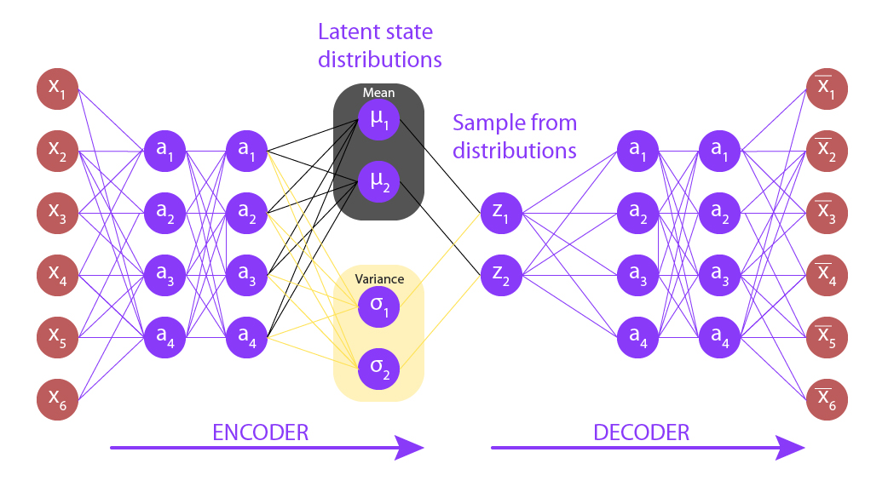

# Variational Autoencoder (VAE) on MNIST

**Gaussian Latent Space Modeling & Manifold Visualization (PyTorch Implementation)**

## About

This notebook implements a Variational Autoencoder (VAE) trained on the MNIST handwritten digit dataset.

Unlike a classical autoencoder that learns a deterministic latent code, a VAE:

- Learns a probabilistic latent representation
- Regularizes the latent space toward a standard Gaussian prior
- Enables structured sampling and interpolation
- Optimizes a principled objective derived from variational inference

The objective is to understand:

- Why classical autoencoders cannot properly generate new data
- How probabilistic latent modeling enables sampling
- Why KL divergence regularization structures the latent space
- How interpolation reveals the learned data manifold

## Objectives

- Understand the difference between Autoencoder and Variational Autoencoder
- Implement a VAE in PyTorch
- Implement reparameterization trick
- Implement KL divergence regularization
- Train a VAE on MNIST
- Visualize interpolation in latent space
- Explore 2D latent space geometry

## Dataset

- **MNIST handwritten digit dataset**
- 60,000 training images
- 10,000 test images
- 28 × 28 grayscale images
- Pixel values in [0,1]
- Flattened to 784-dimensional vectors
- Batch size: 100

## Model Architecture

### Encoder

**Input:** 784-dimensional flattened image

**Architecture:**
- Linear → ReLU
- Linear → ReLU
- Two output heads:
    - $\mu(x)$ (mean of latent distribution)
    - $\log(\sigma^2(x))$ (log-variance)
- Latent dimension: 2

The encoder outputs: $q(z|x) = \mathcal{N}(\mu(x), \text{diag}(\sigma^2(x)))$

### Reparameterization Trick

Instead of sampling directly from $z \sim \mathcal{N}(\mu, \sigma^2)$, we use:

$$z = \mu + \sigma \odot \epsilon \quad \text{where} \quad \epsilon \sim \mathcal{N}(0, I)$$

This allows gradients to flow through $\mu$ and $\sigma$.

### Decoder

**Input:** latent vector $z \in \mathbb{R}^2$

**Architecture:**
- Linear → ReLU
- Linear → ReLU
- Linear → Sigmoid

**Output:** 784-dimensional reconstructed image

The decoder models: $p(x|z)$

## Learning Objective

The VAE minimizes:

$$L = \text{Reconstruction Loss} + \text{KL Divergence}$$

### Reconstruction Term

Binary Cross Entropy:

$$L_{\text{rec}} = \text{BCE}(x_{\text{rec}}, x)$$

Encourages accurate reconstruction.

### KL Divergence Term

$$\text{KL}(q(z|x) \| p(z)) = \frac{1}{2}\left[-\sum(1 + \log \sigma^2) + \sum \sigma^2 + \sum \mu^2\right]$$

Regularizes latent distribution toward $p(z) = \mathcal{N}(0, I)$

This enforces a continuous and smooth latent space.

## Training Setup

- **Optimizer:** Adam
- **Epochs:** 4
- **Latent dimension:** 2
- **Test loss (after training):** ≈ 148

Typical observations:
- Loss decreases over epochs
- Generated digits improve progressively
- Latent space becomes organized

## Latent Space Interpolation

We sample two latent vectors and interpolate:

$$z_\alpha = (1-\alpha)z_0 + \alpha z_1$$

**Observation:**
- Digits morph smoothly from one identity to another
- No abrupt transitions
- Indicates structured latent manifold
- A classical autoencoder would not exhibit this smooth behavior

## 2D Latent Grid Visualization

We sample a 10×10 grid in $[-1,1] \times [-1,1]$

**Observation:**
- Different regions correspond to different digit types
- Neighboring points generate visually similar digits
- Far regions correspond to different classes
- Borders may produce less realistic samples (low prior density)

This confirms that the VAE learned a continuous low-dimensional representation of digit identity.

## Core Learnings

- VAE introduces probabilistic latent modeling
- KL divergence structures the latent space
- Reparameterization enables gradient flow
- Sampling becomes principled and stable
- Interpolation reveals manifold geometry
- VAE learns a distribution, not just reconstructions

## Limitations

- Only 4 epochs
- Small latent dimension (2)
- Slight blur in generated images
- BCE assumption may limit sharpness
- MNIST is a simple dataset

## Possible Improvements

- Increase latent dimension
- Train longer
- Use convolutional encoder/decoder
- Introduce β-VAE
- Evaluate log-likelihood estimates
- Train on CIFAR-10

## Dependencies

- numpy
- torch
- torchvision
- matplotlib

---

***Alexandre Mathias Donnat, Sr***
