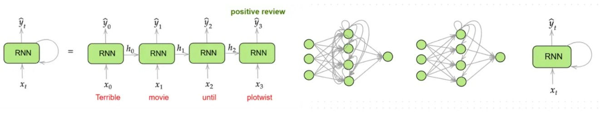

# Recurrent Neural Networks for Movie Review Sentiment Classification

**LSTM-based Many-to-One Sequence Modeling in PyTorch (IMDB Dataset)**

### About

This notebook implements and studies neural sequence models for binary sentiment classification of movie reviews using the IMDB dataset.

Unlike traditional bag-of-words approaches, the models learn from the ordered sequence of words in each review.

Two architectures are implemented and compared:

- Mean-Embedding Model (Embedding + Temporal Average)
- LSTM-based Many-to-One Model

The objective is to understand how sequence modeling improves performance over simple averaged word representations.

### Objectives

- Understand sequence modeling for text classification
- Implement word embeddings using `nn.Embedding`
- Handle variable-length sequences via truncation and padding
- Implement a Many-to-One LSTM architecture in PyTorch
- Compare mean pooling vs recurrent modeling
- Inspect learned embeddings to find semantic word equivalences

### Dataset

**IMDB Movie Review Dataset** (Keras built-in version)

- 25,000 training reviews
- 25,000 test reviews
- Binary labels: 0 (negative), 1 (positive)
- Only the top 5000 most frequent words are kept in the vocabulary
- Each review is encoded as a sequence of word indices

### Data Processing

Reviews have variable lengths. To enable mini-batch training, sequences are:

- Truncated if too long
- Zero-padded if too short
- Final fixed length: $T_x = 100$
- Padding mode: pre

Pre-padding aligns the last meaningful words at the end of the sequence because the classification decision is taken after reading the whole sequence.

**Pipeline:** Raw index sequence → Truncate/Pad → Tensor → DataLoader

### Learning Problem Setup

We model: $\hat{y} = f(x_1, x_2, \ldots, x_T)$

Where:

- Vocabulary size: $n_{\text{word}} = 5000$
- Sequence length: $T_x = 100$
- Output: $\hat{y} \in [0, 1]$
- Loss: $L = \text{BCELoss}(\hat{y}, y)$
- Optimizer: Adam (learning rate = 0.001)

### Model 1: Mean Embedding Classifier

#### Architecture

Embedding Layer → Mean over time → Linear layer → Sigmoid

**Details:**

- Embedding dimension: 32
- Temporal aggregation: $m = \frac{1}{T_x} \sum_{t=1}^{T_x} e(t)$
- Output: 1 neuron with Sigmoid

This model ignores word order but learns semantic representations.

#### Results

After 8 epochs:

- Train accuracy: 84–89%
- Test accuracy: 84–86%

This behaves like a learned bag-of-words model.

### Model 2: LSTM Many-to-One Classifier

The temporal averaging step is replaced by a recurrent layer.

#### Architecture

Embedding Layer → LSTM (hidden size = 100) → Last hidden state → Linear → Sigmoid

**Configuration:**

- `batch_first=True`
- Hidden size: 100
- $h_t, c_t = \text{LSTM}(e_t, h_{t-1}, c_{t-1})$
- Prediction uses: $h_T$

This allows the model to capture word order and temporal dependencies.

#### Results

After 8 epochs:

- Train Accuracy: 89–90%
- Validation Accuracy: 85–87%

The LSTM consistently outperforms the mean model. Word order matters, LSTM captures negations and local dependencies, and temporal modeling improves classification robustness.

### Embedding Analysis: Word Equivalence

The trained embedding matrix $E \in \mathbb{R}^{5000 \times 32}$ was extracted from the `nn.Embedding` layer. Nearest neighbors were computed using Euclidean distance.

**Observation:** Semantically related words cluster together in embedding space. This demonstrates that sentiment supervision induces meaningful semantic structure.

### Core Learnings

- Sequence modeling generalizes from language modeling to classification
- Mean pooling is simple but discards temporal structure
- LSTMs model long-range dependencies
- Padding strategy affects performance
- Embedding layers learn semantic geometry from supervision alone
- Recurrent models significantly improve expressive power over static representations

### Limitations

- No masking of PAD tokens
- No packed sequences (`pack_padded_sequence`)
- No regularization (dropout)
- Binary classification only
- No pre-trained embeddings (e.g., GloVe)

### Possible Improvements

- Use packed sequences to ignore PAD tokens
- Replace LSTM with GRU
- Add dropout between layers
- Use `BCEWithLogitsLoss` (more numerically stable)
- Use bidirectional LSTM
- Try attention mechanism
- Compare with Transformer encoder

### Dependencies

- `numpy`
- `torch`
- `matplotlib`
- `keras` (for IMDB dataset)

---

***Alexandre Mathias DONNAT, Sr***
