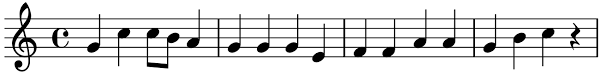
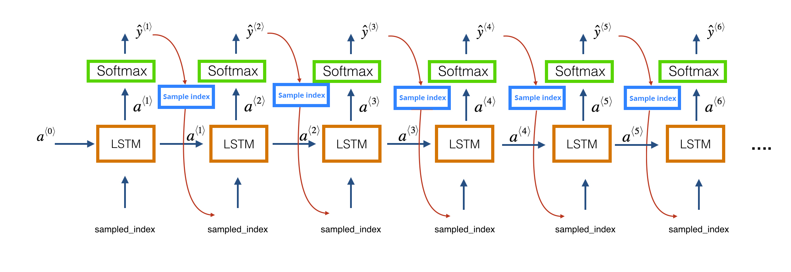

# Recurrent Neural Network Language Model for Bach Cello Suites

**LSTM-based Sequence Modeling, Auto-Regressive Sampling & MIDI Generation in PyTorch**

## About

This notebook implements and studies a Recurrent Neural Network (LSTM) trained as a language model for symbolic music generation.

Instead of modeling text, the model learns the statistical structure of Johann Sebastian Bach's Cello Suites using their MIDI symbolic representation.

**Objectives:**
- Understand sequence modeling as next-step prediction
- Implement a stacked LSTM architecture in PyTorch
- Convert symbolic music (MIDI) into one-hot encoded sequences
- Train a neural language model using CrossEntropyLoss
- Generate new musical sequences using auto-regressive sampling
- Convert generated sequences back into audible MIDI/audio

**Workflow:**
- MIDI → One-hot encoding
- Data conversion for next-step prediction
- Training a deep LSTM language model
- Auto-regressive sampling and audio synthesis

## Learning Problem Setup

We consider symbolic music sequences represented as ordered note indices.

- **Vocabulary size:** $n_x = 79$
- **Sequence:** $x = (x^1, x^2, ..., x^T)$ where each element is a one-hot vector in $\mathbb{R}^{n_x}$
- **Objective:** Learn $p(x^{t+1} | x^1, x^2, ..., x^t)$

**Training pairs:**
- Input: $X[t : t+T-1]$
- Target: $Y[t+1 : t+T]$ (shifted by one)

## Model Architecture

1. LSTM Layer (hidden size: 32) + Dropout
2. LSTM Layer (hidden size: 32) + Dropout
3. LSTM Layer (hidden size: 32)
4. MLP Projection (Linear → 32, Tanh, Dropout)
5. Output Layer (Linear → 79 logits)

*Note: Final Softmax is handled inside the loss function.*

## Loss Function and Training

- **Loss:** CrossEntropyLoss (applies Softmax internally)
- **Optimizer:** Adam
- **Strategy:** Mini-batch learning with teacher forcing

## MIDI Preprocessing

- Read using `pretty_midi`
- Extract pitch values only
- Truncate to `max_midi_T_x`
- Convert to one-hot encoding with base pitch offset: $pitch\_index = pitch\_midi - base\_pitch$

## Auto-Regressive Generation

At each timestep:
1. Model receives one-hot encoding of previous note + LSTM hidden states
2. Output: $logits \in \mathbb{R}^{n_x}$
3. Convert to probabilities via Softmax
4. Sample via argmax or multinomial sampling

## Temperature Scaling

Control output diversity: $softmax(logits / T)$

- $T < 1$ → sharper, deterministic
- $T > 1$ → softer, random
- $T = 1$ → standard softmax

## MIDI Reconstruction

Generated indices → MIDI pitches: $pitch\_midi = base\_pitch + note\_index$

## Core Learnings

- Sequence prediction generalizes to music
- LSTMs capture temporal dependencies
- Auto-regressive sampling enables generation
- Temperature controls diversity/structure
- Proper encoding/decoding alignment is crucial

## Possible Improvements

- Replace LSTM with GRU or Transformer
- Use embedding layer instead of one-hot
- Add attention mechanism
- Tune learning rate schedule
- Use richer MIDI features (duration, velocity)

## Dependencies

- numpy
- matplotlib
- torch
- pretty_midi
- IPython

---

***Alexandre Mathias DONNAT, Sr***

