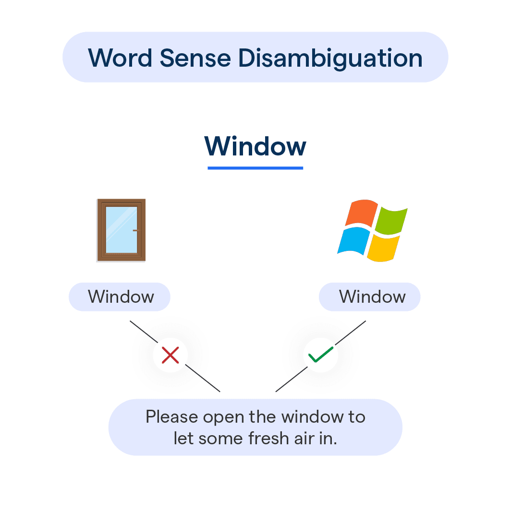

# Entity Disambiguation with YAGO

**Wikipedia Mentions, Candidate Ranking & Knowledge Base Linking**



## About

This repository presents a practical lab on **Named Entity Disambiguation (NED)**, also known as **Entity Linking**.

The goal is not only to recognize that a word is an entity, but to determine **which real-world entity** it refers to in a knowledge base.

For example, the surface form:

```text
Paris
```

can refer to:

```text
Paris_(France)
Paris_(mythology)
Paris_Hilton
```

The objective of this lab is therefore to map an ambiguous Wikipedia article title and its textual context to the correct YAGO entity.

```text
ambiguous Wikipedia title + article content
→ correct YAGO entity
```

Rather than treating entity names as isolated strings, this work emphasizes:

* the ambiguity of natural language labels;
* the role of context in entity interpretation;
* the use of knowledge bases such as YAGO;
* candidate generation from entity labels;
* candidate ranking using textual similarity;
* evaluation through precision, recall, and F-score.

## Task Overview

Given a Wikipedia article such as:

```text
Paris #17
<Paris> is a figure in Greek mythology.
```

the system must infer that the correct entity is:

```text
yago:Paris_(mythology)
```

and not:

```text
yago:Paris_France
```

The key intuition is simple:

```text
Greek, mythology, figure
→ strongly suggests Paris_(mythology)
```

The task is therefore a contextual linking problem:

```text
mention in text → candidate YAGO entities → best entity
```

## NLP Context

This lab belongs to the field of **Natural Language Processing (NLP)**.

More precisely, it is part of the semantic information extraction pipeline:

```text
Text
→ Named Entity Recognition
→ Entity Disambiguation
→ Fact Extraction
→ Knowledge Base Construction
```

In this lab, the focus is on the middle step:

```text
Entity Disambiguation = choosing the correct entity behind an ambiguous name
```

This is different from basic NER.

```text
NER  = detect "Paris"
NED  = decide whether it means Paris_(France), Paris_(mythology), etc.
```

## Mathematical Framework

Let a document be represented as a sequence of tokens:

```text
d = (w1, w2, ..., wT)
```

Let an entity mention be:

```text
m
```

For each mention, the system retrieves a set of candidate entities from YAGO:

```text
C(m) = {e1, e2, ..., ek}
```

The goal is to learn or define a scoring function:

```text
score(e, m, d)
```

and select the best candidate:

```text
e* = argmax score(e, m, d)
```

where:

```text
e ∈ C(m)
```

In this lab, the score is based mainly on **contextual overlap** between the article content and the information available for each candidate entity.

## Candidate Generation

The first step is to generate possible YAGO candidates for a given ambiguous title.

For example:

```text
m = "Paris"
```

Possible candidates include:

```text
Paris_(France)
Paris_(mythology)
Paris_Hilton
```

The candidate generation step relies on the idea that entities in a knowledge base have labels, aliases, or identifiers that can match the surface form appearing in the article.

Main idea:

```text
same or similar label
→ possible candidate entity
```

## Context-Based Scoring

Once candidates are generated, the system compares the article context with each candidate description or available metadata.

Example article:

```text
Paris is a figure in Greek mythology.
```

Candidate contexts:

```text
Paris_(France)      → city, France, capital, Europe
Paris_(mythology)   → Greek, mythology, Trojan, figure
Paris_Hilton        → person, celebrity, actress
```

The article shares more meaningful words with:

```text
Paris_(mythology)
```

so this candidate receives the highest score.

A simplified scoring function can be written as:

```text
score(e, d) = |words(d) ∩ words(e)|
```

or, more generally:

```text
score(e, d) = similarity(context_document, context_entity)
```

Interpretation:

The more a candidate entity shares contextual information with the article, the more likely it is to be the correct entity.

## Implemented Approach

The lab required completing a function:

```python
disambiguate()
```

The implemented strategy follows a simple but effective pipeline:

```text
1. Read the ambiguous Wikipedia title.
2. Retrieve candidate YAGO entities.
3. Extract words from the Wikipedia article.
4. Compare article words with candidate information.
5. Select the candidate with the strongest contextual overlap.
6. Return the predicted YAGO entity.
```

This is a lightweight rule-based / similarity-based approach.

It does not require training a neural model, but it already captures the core idea of entity linking:

```text
the meaning of an entity is determined by its context
```

## Example

Input:

```text
Title: Paris #17
Article: Paris is a figure in Greek mythology.
```

Candidate entities:

```text
Paris_(France)
Paris_(mythology)
Paris_Hilton
```

Contextual clues:

```text
figure
Greek
mythology
```

Prediction:

```text
yago:Paris_(mythology)
```

Reason:

```text
The article context matches mythology-related information,
not geographic or celebrity-related information.
```

## Evaluation Metrics

The system is evaluated using:

* Precision
* Recall
* F0.5-score

Precision measures how many predicted links are correct:

```text
Precision = correct_predictions / total_predictions
```

Recall measures how many expected links were successfully found:

```text
Recall = correct_predictions / total_gold_entities
```

F0.5 combines precision and recall while giving more importance to precision:

```text
Fβ = (1 + β²) · (Precision · Recall) / (β² · Precision + Recall)
```

with:

```text
β = 0.5
```

This means false positives are penalized more strongly than false negatives.

## Results

The obtained results were approximately:

```text
Precision ≈ 77.6%
Recall    = 100%
F0.5      ≈ 81.25%
```

Interpretation:

The system retrieves all expected entities, which explains the perfect recall.

However, some predictions are incorrect, which reduces precision.

This is typical of simple candidate-matching approaches:

```text
high recall
but some noisy predictions
```

## Key Observations

The lab highlights several important ideas:

* entity names are often ambiguous;
* labels alone are not enough;
* context is essential for semantic interpretation;
* knowledge bases provide structured candidate entities;
* simple similarity-based methods can already perform reasonably well;
* better systems would combine label similarity, context similarity, priors, and global consistency.

## Methodological Perspective

This lab shows that semantic NLP is not only about detecting words.

A model must also understand what these words refer to.

The central difficulty is:

```text
same surface form
different real-world entities
```

For example:

```text
Paris → city
Paris → mythological figure
Paris → person
```

The solution is to use the surrounding context and compare it with structured knowledge.

This makes entity disambiguation a key bridge between:

```text
natural language
and
knowledge bases
```

## Possible Improvements

The current method could be improved by adding:

* TF-IDF weighted context similarity;
* Jaccard similarity between article and entity descriptions;
* prior probabilities from Wikipedia links;
* type constraints;
* embedding-based similarity;
* BERT-style encoder reranking;
* global coherence between all entities in the document.

A stronger scoring function could combine several signals:

```text
score(e, m) =
α · label_similarity(e, m)
+ β · context_similarity(e, m)
+ γ · prior_probability(e, m)
```

This would make the model more robust than using context overlap alone.

## Dependencies

```text
python
pandas
numpy
re
collections
scikit-learn
```

Optional:

```text
nltk
spacy
```
---
***Alexandre Mathias DONNAT***
