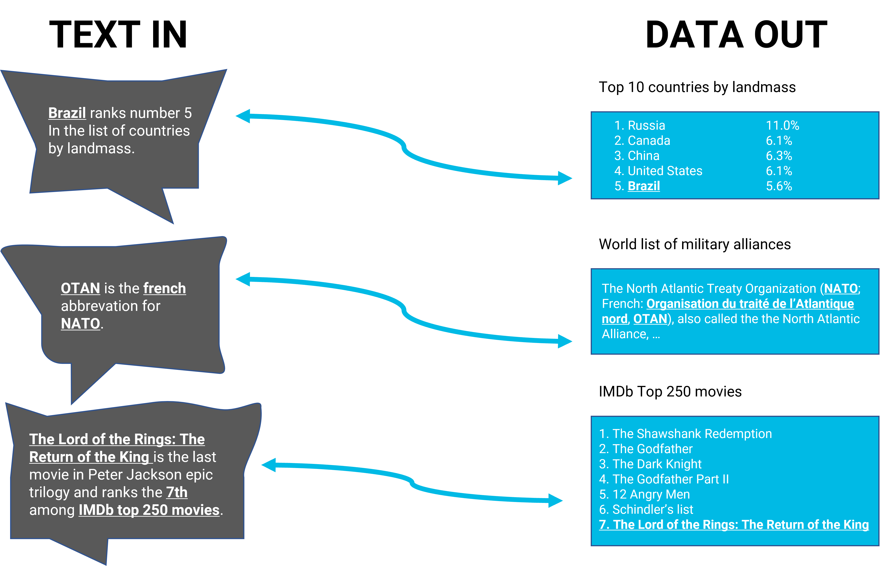

# Relation Classification for Fact Extraction

## Language Models, Constrained Decoding & Knowledge Base Triples



## About

This repository presents a structured lab on relation classification for fact extraction from preprocessed Wikipedia articles.

The goal is to extract structured facts from text by predicting semantic relations between a Wikipedia title entity and other disambiguated entities mentioned in the article.

For example, given an article such as:

```text
<Elvis_Presley> was an <United_States_of_America> singer and actor, married to <Priscilla_Presley>.
```

the objective is to predict triples such as:

```text
<Elvis_Presley>    <United_States_of_America>    <nationality>
<Elvis_Presley>    <Priscilla_Presley>           <spouse>
```

This task belongs to the broader field of **Information Extraction**, where natural language text is transformed into structured knowledge that can later be stored in a database or a knowledge graph.

Rather than using a purely rule-based system, this lab uses a pretrained language model combined with constrained decoding. The model generates a relation label, but its output is restricted to the set of valid relations observed in the gold standard.

This work emphasizes:

* the link between natural language and structured facts;
* relation classification as a core task of information extraction;
* the use of pretrained language models for semantic prediction;
* constrained decoding to force valid relation outputs;
* trie-based restriction of generated tokens;
* evaluation with precision, recall and F-0.5 score.

## Task Definition

Let an article be associated with a title entity:

```text
s = <title_entity>
```

and let the article content contain several other disambiguated entities:

```text
o_1, o_2, ..., o_n
```

The objective is to predict, for each pair:

```text
(s, o_i)
```

a relation:

```text
r ∈ R
```

where `R` is the set of possible relation labels extracted from the gold-standard file.

The final output is a list of triples:

```text
subject_entity    object_entity    relation
```

Example:

```text
<Elvis_Presley>    <United_States_of_America>    <nationality>
<Elvis_Presley>    <Priscilla_Presley>           <spouse>
```

## Mathematical Framework

The relation classification task can be represented as a function:

```text
f(s, o, c) → r
```

where:

* `s` is the subject entity;
* `o` is the object entity;
* `c` is the textual context;
* `r` is the predicted relation.

The model receives a prompt containing the subject, object and local context, and generates a relation label.

Formally:

```text
r̂ = argmax P(r | s, o, c)
```

However, instead of allowing the model to generate any text, the output space is restricted:

```text
r̂ ∈ R
```

where `R` is the list of valid relations.

This restriction is implemented using **constrained decoding**.

## Language Model

The lab uses a pretrained sequence-to-sequence language model:

```text
google/flan-t5-large
```

T5 is an encoder-decoder transformer model.

The input prompt is encoded by the encoder, and the decoder generates the relation label token by token.

A simplified generation process is:

```text
Input prompt → Encoder → Decoder → Generated relation
```

Example prompt structure:

```text
Subject: <Elvis_Presley>
Object: <Priscilla_Presley>
Text: <Elvis_Presley> was married to <Priscilla_Presley>.
Relation:
```

Expected output:

```text
<spouse>
```

## Constrained Decoding

A central part of this lab is constrained decoding.

Normally, a language model can generate any sequence of tokens. This is risky for relation classification because the model may generate:

* invalid relations;
* paraphrases;
* incomplete labels;
* natural language explanations;
* formatting errors.

To avoid this, the decoder is constrained so that it can only generate relation labels that belong to the valid relation set.

The allowed relations are extracted from:

```text
student-gold-standard.tsv
```

Then, each relation is tokenized and inserted into a trie.

During generation, at each decoding step, only the next tokens compatible with at least one valid relation are allowed.

This forces the model to generate one of the known relation labels.

## Trie Structure

A trie is a prefix tree used to store tokenized relations.

For example, if the valid relations are:

```text
<nationality>
<birthPlace>
<birthDate>
```

they are tokenized and inserted as sequences of token IDs.

The trie allows the decoder to answer the following question at each step:

```text
Given the tokens already generated, which next tokens are still valid?
```

This makes the decoding process deterministic with respect to the allowed output space.

The function:

```python
construct_trie(relations, tokenizer)
```

builds this trie from the valid relations.

## Relation Classification Pipeline

The full pipeline is structured as follows:

### Step 1 - Load the Data

The lab uses two main files:

```text
wikipedia-ner.txt
student-gold-standard.tsv
```

The first file contains Wikipedia articles where entities have already been detected and disambiguated.

The second file contains gold-standard triples used both to extract the valid relation labels and to evaluate the predictions.

### Step 2 - Extract Valid Relations

All relation labels are extracted from the gold standard:

```python
relations = get_all_relations("student-gold-standard.tsv")
```

These relations define the allowed output space.

### Step 3 - Build the Trie

Each relation is tokenized and inserted into a trie:

```python
trie = construct_trie(relations, tokenizer)
```

This trie is later used during constrained decoding.

### Step 4 - Detect Object Entities

For each Wikipedia article, the title entity is considered the subject.

All other entities appearing in the article are considered candidate object entities.

The task is then to classify the relation between:

```text
title_entity → object_entity
```

### Step 5 - Prompt the Language Model

For each candidate pair, a prompt is built using:

* the subject entity;
* the object entity;
* a local textual context around the object entity.

The language model predicts the most likely relation.

### Step 6 - Generate the Results File

Predicted triples are written to:

```text
results.tsv
```

Each line follows the format:

```text
subject_entity    object_entity    relation
```

## Evaluation

The evaluation compares the predicted triples with the gold-standard triples.

The following metrics are used:

### Precision

Precision measures how many predicted relations are correct:

```text
Precision = TP / (TP + FP)
```

High precision means that when the system predicts a relation, it is usually correct.

### Recall

Recall measures how many expected relations are found:

```text
Recall = TP / (TP + FN)
```

High recall means that the system covers most of the gold-standard relations.

### F-0.5 Score

The lab uses the F-0.5 score:

```text
F_0.5 = (1 + 0.5²) · (Precision · Recall) / (0.5² · Precision + Recall)
```

Unlike the standard F1 score, F-0.5 gives more weight to precision.

This makes sense for fact extraction, because adding wrong facts to a knowledge base can be more harmful than missing some facts.

## Experimental Results

In the final run, the system produced predictions for the full dataset and generated a valid `results.tsv` file.

The obtained evaluation scores were:

```text
Precision: 27.66
Recall:    100.00
F-0.5:     32.34
```

Interpretation:

* The recall is very high because the system predicts a relation for every expected entity pair.
* The precision is lower because many predicted relations are semantically incorrect.
* The final F-0.5 score reflects this precision penalty.

This result shows that the pipeline is functional, but also highlights the difficulty of relation classification with a generic prompt and a pretrained language model.

## Key Observations

This lab illustrates several important points:

* Constrained decoding ensures valid relation labels, but it does not guarantee semantic correctness.
* A pretrained language model can perform relation classification without task-specific fine-tuning.
* Prompt design strongly affects the quality of the predictions.
* Using local context is useful, but may still miss global information from the article.
* Relation classification is harder when relations are semantically close, such as:

  * `<birthPlace>` vs `<nationality>`;
  * `<location>` vs `<locationCreated>`;
  * `<actor>` vs `<director>`;
  * `<manufacturer>` vs `<productionCompany>`.

## Methodological Perspective

This lab is not only about obtaining predictions. It is mainly about understanding how modern NLP models can be used to transform text into structured facts.

The work connects several core NLP concepts:

* Named Entity Recognition;
* Entity Disambiguation;
* Information Extraction;
* Relation Classification;
* Knowledge Base Construction;
* Language Model prompting;
* Constrained generation.

The main methodological insight is that language models can be used as flexible semantic classifiers, but their outputs must be controlled when the task requires strict symbolic formats.

Constrained decoding bridges this gap by combining:

```text
neural generation + symbolic output constraints
```

This makes the approach especially relevant for knowledge graph construction, where outputs must follow a predefined schema.

## Repository Structure

```text
LAB_FACT_EXTRACTION/
│
├── Relation_Classification_Lab.ipynb
├── relation_classification_lab.py
├── student-gold-standard.tsv
├── wikipedia-ner.txt
├── results.tsv
└── README.md
```

## Main Components

### Data Loading

Handles the reading of Wikipedia articles and gold-standard triples.

### Trie Construction

Builds a prefix tree over tokenized relation labels.

### Constrained Decoding

Restricts the model generation to valid relation labels only.

### Relation Classification

Builds prompts and predicts relations between title entities and object entities.

### Evaluation

Computes precision, recall and F-0.5 score against the gold standard.

## Dependencies

```text
transformers
sentencepiece
accelerate
torch
numpy
tqdm
```

Install dependencies with:

```bash
pip install transformers sentencepiece accelerate torch numpy tqdm
```

## How to Run

The lab is designed to run on Google Colab with GPU acceleration.

Recommended steps:

1. Open the notebook in Google Colab.
2. Select a GPU runtime.
3. Upload the required data files:

   * `student-gold-standard.tsv`
   * `wikipedia-ner.txt`
4. Install the required dependencies.
5. Run the notebook cells.
6. Generate `results.tsv`.
7. Run the evaluation script.

---
***Alexandre Mathias DONNAT, Sr***
