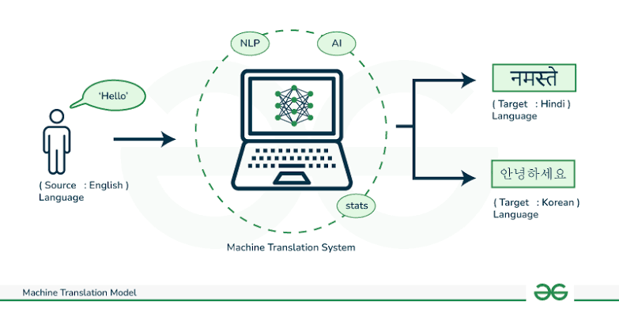

# Neural Machine Translation with Seq2Seq, Attention & Beam Search

GRU Encoder-Decoder, Attention Mechanism, BLEU Evaluation & Back-Translation

## About

This repository presents a structured exploration of Machine Translation (MT), a subfield of Natural Language Processing focused on automatically translating a sentence from a source language to a target language.

The objective is not only to build a working English-to-French translation model, but to understand the core mechanisms behind neural translation systems:

* how text is converted into numerical sequences;
* how an encoder-decoder model maps one sequence to another;
* why attention improves the decoder’s access to source information;
* how decoding strategies such as greedy decoding and beam search affect generation;
* how translation quality can be evaluated with BLEU;
* how back-translation can be used as a data augmentation technique.

The experiments are conducted on an English-French parallel corpus using PyTorch.

## Machine Translation Framework

Let a source sentence be represented as a sequence of tokens:

$$x = (x_1, x_2, ..., x_T)$$

The goal is to generate a target sentence:

$$y = (y_1, y_2, ..., y_S)$$

The model learns the conditional probability:

$$P(y|x)$$

In practice, the translation is generated token by token:

$$P(y|x) = \prod\_{t=1}^{S} P(y\_t|y\_{<t}, x)$$

This means that each predicted word depends both on the previously generated target words and on the source sentence.

## Data Preprocessing

The raw parallel corpus is cleaned and normalized before training.

Main steps:

* lowercasing;
* removing irrelevant characters;
* splitting English-French sentence pairs;
* building source and target vocabularies;
* converting words into token indices;
* adding special tokens.

Special tokens:

* `PAD`: used to pad sentences to the same length;
* `SOS`: start-of-sentence token given to the decoder;
* `EOS`: end-of-sentence token used to stop generation.

Each sentence is transformed into a fixed-length tensor of token indices.

## Seq2Seq Baseline

The first model is a classical encoder-decoder architecture based on GRUs.

The encoder reads the source sentence:

$$h_t = GRU(e_t, h_{t-1})$$

The final hidden state is used as a compressed representation of the source sentence.

The decoder then generates the target sentence step by step:

$$s_t = GRU(y_{t-1}, s_{t-1})$$

$$P(y_t) = softmax(Ws_t + b)$$

Main properties:

* simple and interpretable architecture;
* works reasonably well on short sentences;
* limited because the whole source sentence is compressed into a single vector.

This creates an information bottleneck, especially for longer sentences.

## Teacher Forcing

During training, the decoder is helped by receiving the true previous target token instead of its own previous prediction.

This technique is called **teacher forcing**.

It makes training faster and more stable, but creates a gap between training and inference, since during inference the model must rely on its own generated tokens.

## Attention Mechanism

An attention mechanism is then added to reduce the bottleneck of the basic seq2seq model.

Instead of relying only on the final encoder hidden state, the decoder can look at all encoder outputs.

At each decoding step, attention computes weights over the source tokens:

$$\alpha_t = softmax(q_t K^T)$$

The context vector is then computed as a weighted sum:

$$c_t = \sum_i \alpha_{t,i} h_i$$

Main intuition:

> At each generated word, the decoder learns which source words are most useful.

This makes translation more flexible and introduces the core idea behind modern Transformer models.

## Decoding Strategies

Two decoding strategies are compared.

### Greedy Decoding

Greedy decoding selects the most probable next token at each step:

$$y\_t = \argmax P(y\_t | y\_{<t}, x)$$

It is fast, but locally optimal decisions can lead to weaker full translations.

### Beam Search

Beam search keeps several candidate translations at each step.

Instead of keeping only one path, it keeps the best (k) partial sequences according to their cumulative log-probability.

Main properties:

* explores more translation candidates;
* can improve final sequence quality;
* slower than greedy decoding;
* performance depends on beam width and length normalization.

## Evaluation with BLEU

Translation quality is evaluated using the BLEU score.

BLEU compares the generated translation with the reference translation by measuring n-gram overlap.

A simplified view:

$$BLEU = BP \cdot \exp\left(\sum_n w_n \log p_n\right)$$

where:

* $p_n$ is the modified precision for n-grams;
* $BP$ is the brevity penalty;
* higher BLEU usually indicates better translation quality.

In this experiment, the basic seq2seq model achieved a stronger BLEU score than the attention model because the attention model was intentionally trained for fewer epochs.

This does not mean attention is worse. It mainly reflects undertraining.

## Back-Translation

Back-translation is introduced as a data augmentation technique.

The idea is:

1. train a reverse model from French to English;
2. use it to generate synthetic English sentences from French sentences;
3. create additional synthetic English-French pairs;
4. retrain the original English-to-French model on the augmented dataset.

This technique is useful in low-resource translation settings because it increases the amount of parallel training data.

In this lightweight experiment, back-translation did not improve BLEU because the reverse model was trained only briefly, producing noisy synthetic data.

## HuggingFace Comparison

A pretrained HuggingFace model, `Helsinki-NLP/opus-mt-en-fr`, was selected as an external benchmark.

This type of model is expected to outperform the small GRU-based models trained in this lab because it was trained on a much larger translation corpus with a stronger architecture.

The comparison highlights the gap between:

* a didactic model trained from scratch during a lab;
* a large pretrained neural machine translation system.

## Experiments

The repository explores:

* preprocessing and vocabulary construction;
* tensorization of text sequences;
* GRU encoder-decoder translation;
* teacher forcing during training;
* inference with greedy decoding;
* attention-based decoding;
* attention visualization;
* BLEU score evaluation;
* beam search decoding;
* back-translation augmentation;
* comparison with pretrained translation models.

## Key Observations

The main lessons are:

* seq2seq models can learn basic translation patterns;
* compressing a full sentence into one hidden state is limiting;
* attention gives the decoder access to all source states;
* BLEU provides an automatic but imperfect measure of quality;
* beam search improves decoding but cannot fix a weak model;
* back-translation depends heavily on the quality of the reverse model;
* pretrained translation models are much stronger than small models trained from scratch.

## Repository Structure

### Step 1 - Data Preparation

Focus:

* text normalization;
* sentence pair extraction;
* vocabulary construction;
* tensor conversion.

### Step 2 - Seq2Seq Baseline

Focus:

* GRU encoder;
* GRU decoder;
* teacher forcing;
* training loop.

### Step 3 - Attention Model

Focus:

* dot-product attention;
* context vector computation;
* attention visualization.

### Step 4 - Evaluation

Focus:

* qualitative translation examples;
* BLEU score;
* greedy decoding;
* beam search.

### Step 5 - Data Augmentation

Focus:

* reverse translation model;
* synthetic source generation;
* back-translation experiment.

## Dependencies

* Python
* NumPy
* Pandas
* Matplotlib
* PyTorch
* Transformers

---
***Alexandre Mathias DONNAT, Sr***
