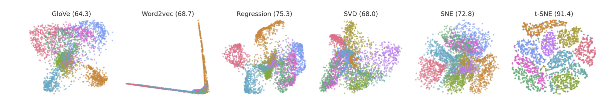

# Text Representations for Document Classification  
*Latent variable models: Independent Component Analysis (ICA) and Non-negative Matrix Factorization (NMF) : Sparse Models, Topic Modeling & Word Embeddings*

## 1. About

This notebook provides a comparative study of text representation methods for document classification using the 20 Newsgroups dataset.

Rather than treating representations as black-box preprocessing steps, the objective is to understand what linguistic information each representation captures, how it is constructed, and why it performs well or poorly depending on modeling assumptions.

We explore a wide range of approaches, from classical sparse representations to dense semantic embeddings, and evaluate them under a unified classification framework.

The study covers:

- Sparse symbolic representations (Bag-of-Words, TF-IDF)
- Topic modeling approaches (LSA, LDA)
- Dense count-based embeddings (PPMI + SVD)
- Prediction-based word embeddings (Word2Vec, GloVe)
- Document representations via aggregation of word embeddings
- Comparative evaluation using classification metrics and confusion matrices

All methods are evaluated on the same downstream task using a logistic regression classifier, enabling fair and interpretable comparisons.

## 2. Learning Problem Setup

We consider a **multi-class text classification** problem.

Each document is represented as a sequence of tokens and associated with a class label:

$$
(X_i, Y_i), \quad Y_i \in \{1, \dots, K\}
$$

The goal is to learn a classifier:

$$
\hat{f}: X \rightarrow Y
$$

by first transforming raw text into numerical representations, then applying a supervised learning algorithm.

Performance is evaluated using:

- accuracy
- macro-averaged F1-score
- confusion matrices

## 3. Sparse Symbolic Representations

### 3.1 Bag-of-Words (BoW)

Documents are represented as high-dimensional sparse vectors counting word occurrences.  
This representation is simple and interpretable but ignores word importance and semantics.

### 3.2 TF-IDF

TF-IDF reweights word counts by penalizing frequent, non-informative terms while emphasizing discriminative words.  
This often leads to improved performance in classification tasks.

## 4. Topic Modeling Representations

### 4.1 Latent Semantic Analysis (LSA)

LSA applies Singular Value Decomposition (SVD) to TF-IDF representations to obtain dense document embeddings capturing global co-occurrence patterns.

### 4.2 Latent Dirichlet Allocation (LDA)

LDA models documents as probabilistic mixtures of latent topics.  
Each document is represented by a topic distribution, providing interpretability at the cost of discriminative power.

## 5. Dense Count-Based Word Embeddings

We construct word embeddings from a co-occurrence matrix using:

- context windows
- optional distance weighting
- Positive Pointwise Mutual Information (PPMI)
- dimensionality reduction via SVD

Document representations are obtained by aggregating word embeddings (mean pooling).

This approach bridges symbolic methods and dense semantic representations.

## 6. Prediction-Based Word Embeddings

### 6.1 Word2Vec

Word2Vec embeddings are learned directly from the training corpus using a prediction-based objective, capturing local semantic relationships between words.

### 6.2 GloVe

GloVe embeddings are pre-trained on large external corpora and encode global co-occurrence statistics.  
They are adapted to the task vocabulary and aggregated to form document representations.

## 7. Aggregation Strategies and Limitations

We investigate the impact of aggregating word representations into document embeddings and show that:

- Aggregation works well for embeddings explicitly trained at the word level (Word2Vec, GloVe).
- Applying aggregation to topic-model components (LSA, LDA) leads to degraded performance, confirming that these models are not designed to produce meaningful word-level embeddings.

## 8. Comparative Analysis and Key Findings

The experimental results highlight several important insights:

- TF-IDF remains a very strong baseline for document classification.
- Dense representations do not automatically outperform sparse models on moderate-sized datasets.
- Topic models are more suitable for document-level representations than word-level aggregation.
- Prediction-based embeddings benefit from large training corpora and richer aggregation strategies.
- Most classification errors arise between semantically similar classes, regardless of representation.
## Ressources used

- Latent Dirichlet Allocation (Blei et al, 2003)
- word2vec Explained: Deriving Mikolov et al.’s Negative-Sampling Word-Embedding Method (Levy and Goldberg, 2014)
- Neural Word Embeddings as Implicit Matrix Factorization (Levy and Goldberg, 2014)

## Core takeaways

- Representation choice strongly impacts downstream performance.
- Sparse lexical features remain highly competitive for text classification.
- Dense embeddings capture semantic structure but require careful aggregation.
- Topic models and word embeddings serve fundamentally different purposes.
- Simple models can outperform complex ones when well aligned with the task.
- Evaluation metrics beyond accuracy are essential for robust analysis.

## Dependencies

- numpy  
- matplotlib  
- scikit-learn  
- nltk  
- gensim  

---

***Alexandre Mathias DONNAT***
