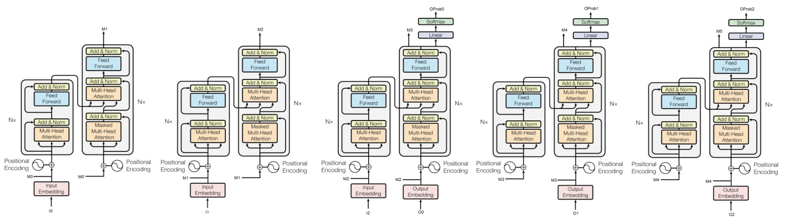

# From Bag-of-Words to Transformers - Text Classification Study

**Averaging Models, Recurrent Architectures & Pretrained Transformers**

## About

This repository presents a structured exploration of text classification models, progressing from simple embedding-based approaches to modern transformer architectures.

The objective is not only to implement different models, but to understand the trade-offs between model simplicity, expressiveness, and computational cost, as well as the impact of pretrained representations.

Rather than treating NLP models as black-box tools, this work emphasizes:

- The loss of information in averaging-based representations
- The role of sequence modeling in recurrent networks
- The impact of pretrained embeddings (GloVe)
- The scaling effect of transformer architectures (DistilBERT)
- The trade-off between performance and number of trainable parameters

The experiments are conducted on a text classification dataset, using progressively more expressive models.

## Mathematical Framework

Let a sentence be represented as a sequence of tokens:

$$x = (w_1, w_2, \ldots, w_T)$$

Each token is mapped to an embedding:

$$e_i \in \mathbb{R}^d$$

The goal is to learn a function:

$$f(x) \rightarrow y$$

where $y$ is a class label.

Three modeling paradigms are explored.

## Averaging Models (Bag-of-Embeddings)

The simplest approach consists in averaging word embeddings:

$$z = \frac{1}{T} \sum_{i=1}^{T} e_i$$

and applying a linear classifier:

$$y = Wz + b$$

Main properties:

- Ignores word order
- Fast and computationally efficient
- Strong baseline with pretrained embeddings

Interpretation: This model assumes that semantic content is additive, which is often too restrictive for complex language patterns.

## Recurrent Models (LSTM)

LSTMs process sequences step-by-step:

$$h_t = \text{LSTM}(e_t, h_{t-1})$$

The final hidden state is used for classification:

$$y = Wh_T + b$$

Main properties:

- Captures sequential dependencies
- Handles variable-length inputs
- Still compresses information into a fixed-size vector

Limitations:

- Difficulty with long-range dependencies
- Training instability
- Higher computational cost than averaging

## Pretrained Embeddings (GloVe)

Pretrained embeddings introduce external semantic knowledge:

$$e_i = \text{GloVe}(w_i)$$

Two strategies are explored:

- Frozen embeddings (no update)
- Fine-tuned embeddings (updated during training)

Trade-off:

- Frozen: better generalization, fewer parameters
- Fine-tuned: better adaptation, higher risk of overfitting

## Transformer Models (DistilBERT)

DistilBERT uses self-attention to model contextual interactions:

$$\text{Attention}(Q, K, V) = \text{softmax}\left(\frac{QK^T}{\sqrt{d}}\right)V$$

Main properties:

- Contextualized embeddings
- Parallel processing of sequences
- Much higher representational capacity

Key insight: The model learns interactions between all tokens simultaneously, rather than sequentially.

## Parameter Scaling

A key aspect of this study is the comparison of model complexity.

Averaging model:
$$\sim O(V \cdot d)$$

LSTM model:
$$\sim O(d \cdot h + h^2)$$

DistilBERT:
$$\sim 66M \text{ parameters}$$

When freezing DistilBERT:
- Trainable parameters drop to ~600K
- Only the classification head is optimized

This highlights a central trade-off: performance vs computational cost vs data efficiency.

## Evaluation Metrics

Classification performance is evaluated using:

- Accuracy
- Confusion Matrix
- Precision / Recall / F1-score

These metrics allow detailed analysis of:

- Class imbalance
- Model confusion patterns
- Generalization ability

## Experiments

The repository compares:

- Averaging model (random embeddings)
- Averaging model with GloVe
- GloVe with and without fine-tuning
- LSTM model
- DistilBERT (full fine-tuning)
- DistilBERT (frozen encoder)

Key observations:

- Pretrained embeddings significantly improve performance
- LSTMs capture order but remain limited
- Transformers outperform all previous models
- Freezing reduces cost with limited performance loss

## Repository Structure

Step 1 – Averaging Models

Focus:
- Vocabulary construction
- Embedding averaging
- Baseline classification

Step 2 – Pretrained Embeddings

Focus:
- GloVe integration
- Fine-tuning vs freezing
- Impact on performance

Step 3 – Recurrent Models (LSTM)

Focus:
- Sequence modeling
- Hidden state representation
- Limitations on long sequences

Step 4 – Transformer Fine-Tuning

Focus:
- Tokenization (DistilBERT)
- HuggingFace Trainer
- Parameter analysis
- Frozen vs full fine-tuning

## Methodological Perspective

This work emphasizes:

- The importance of representation in NLP
- The trade-off between simplicity and expressiveness
- The role of pretraining as a form of transfer learning
- The scaling behavior of modern architectures
- The link between model capacity and generalization

Rather than focusing only on performance, the objective is to understand how and why models improve, and what is gained or lost at each level of complexity.

## Dependencies

- numpy
- pandas
- matplotlib
- scikit-learn
- torch
- transformers

## Author

***Alexandre Mathias DONNAT, Sr***
