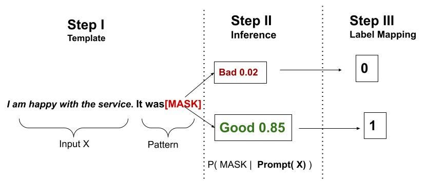

# Zero-shot & Prompt-based Classification with Language Models

*Prompt-based classification, zero-shot learning, noisy channel scoring, few-shot demonstrations and prompt-based fine-tuning with GPT-2.*



## 1. About

This notebook studies how a causal language model can be used for text classification without adding a classical classification head.

Instead of training a standard classifier, the task is reformulated as a language modeling problem: the model receives a prompt and candidate label words are scored using the probability assigned by the language model.

The objective is to understand how small pre-trained language models such as GPT-2 can perform classification through prompting, and how different scoring strategies influence performance.

The study covers:

* Zero-shot classification with GPT-2
* Direct label scoring using next-token logits
* Noisy channel scoring
* Few-shot prompting with demonstrations
* Concat-based and ensemble-based prompting variants
* Prompt-based fine-tuning on SST-2
* Evaluation against majority and random baselines
* Comparison across SST-2 and AG News

The experiments are inspired by:

* *Making Pre-trained Language Models Better Few-shot Learners* — Gao et al. (2021)
* *Noisy Channel Language Model Prompting for Few-Shot Text Classification* — Min et al. (2022)

## 2. Learning Problem Setup

We consider a text classification problem.

Each input text (x) is associated with a label (y):

$$(x_i, y_i), \quad y_i \in \mathcal{C}$$

where $\mathcal{C}$ is the set of possible classes.

In a classical supervised setting, the objective is to learn a classifier:

$$f : x \rightarrow y$$

In this notebook, we instead use a language model to score label words.

For each input text, a prompt is constructed:

```text
Review: x
Sentiment:
```

The model then scores candidate label words such as:

```text
positive
negative
```

The predicted class is the one with the highest score:

$$\hat{y} = \arg\max_{y \in \mathcal{C}} score(y, x)$$

## 3. Zero-shot Classification

Zero-shot classification means that the model performs the task without being trained on task-specific labeled examples.

The model is only guided by the prompt structure.

For example:

```text
Review: The movie was surprisingly touching and well acted.
Sentiment:
```

The model does not directly output a class. Instead, it assigns scores to candidate label words.

This allows a causal language model such as GPT-2 to be used as a classifier, even though it was originally trained only to predict the next token.

## 4. Direct Label Scoring

The first scoring method is direct label scoring.

Given a prompt, the model computes the logits of the next token. The scores of the candidate label tokens are extracted and compared.

For SST-2:

```text
Review: x
Sentiment:
```

The model scores:

```text
" positive"
" negative"
```

The label with the highest next-token logit is selected.

This method is simple and close to the LM-BFF formulation, but it is sensitive to:

* prompt wording
* label word choice
* tokenization
* prior preference of the model for some words

With GPT-2, spaces are important because `" positive"` and `"positive"` may correspond to different tokenization behavior.

## 5. Noisy Channel Scoring

The second method is noisy channel scoring.

Instead of directly scoring:

$$P(y \mid x)$$

the method evaluates how likely the input text is when conditioned on a candidate label:

$$P(x \mid y)$$

For example:

```text
Sentiment: positive
Review: The movie was surprisingly touching and well acted.
```

is compared with:

```text
Sentiment: negative
Review: The movie was surprisingly touching and well acted.
```

The score is computed using the negative language modeling loss.

This formulation can reduce label-word bias because the model is not only asked which label token is likely next, but whether the full text is coherent under a given label.

## 6. Datasets

The notebook evaluates the methods on two datasets.

### 6.1 SST-2

SST-2 is a binary sentiment classification dataset.

Labels:

* `0`: negative
* `1`: positive

It is used to evaluate whether GPT-2 can infer sentiment from short movie review sentences.

### 6.2 AG News

AG News is a four-class topic classification dataset.

Labels:

* `0`: World
* `1`: Sports
* `2`: Business
* `3`: Science / Technology

It is used to test whether the prompting approach also works in a multi-class setting.


## 7. Baselines

Two simple baselines are used for comparison.

### 7.1 Majority Baseline

The majority baseline always predicts the most frequent class in the evaluation set.

This gives a minimal reference point.

### 7.2 Random Baseline

The random baseline predicts a class at random.

This is useful to check whether the language model performs better than chance.

These baselines are important because prompt-based classification can appear sophisticated while still failing to extract meaningful task information.

## 8. Few-shot Prompting Variants

In addition to pure zero-shot prompting, the notebook explores few-shot prompting.

Few-shot prompting means that a small number of labeled examples are inserted into the prompt. The model parameters are not updated.

This is also called in-context learning.

### 8.1 Concat-based Demonstrations

In the concat-based method, several labeled examples are concatenated before the test example:

```text
Review: This movie was terrible.
Sentiment: negative

Review: I loved this film.
Sentiment: positive

Review: x_test
Sentiment:
```

The idea is to show the model the input-output pattern before asking it to classify the test example.

In the experiment, concat-based prompting performs well on SST-2 and reaches about 71.1% accuracy.

### 8.2 Ensemble-based Demonstrations

In the ensemble-based method, each demonstration is used separately.

For each test example, several prompts are built, each containing one demonstration. The scores are then averaged.

This reduces dependence on a single prompt, but in the experiment it performs worse than concat-based prompting, reaching about 54.1% accuracy on SST-2.

This shows that few-shot prompting is sensitive to the demonstration format and the aggregation strategy.

## 9. Prompt-based Fine-tuning

In the second part of the notebook, GPT-2 is fine-tuned on a small subset of SST-2.

The model is still not trained with a classical classification head.

Instead, the training examples are formatted as:

```text
Review: sentence
Sentiment: label
```

The loss is computed only on the label tokens, while the prompt tokens are masked.

This means that the model is trained to generate the correct label word after the prompt.

After fine-tuning, the model reaches about 79.0% accuracy on SST-2, improving over:

* direct zero-shot scoring
* noisy channel zero-shot scoring
* concat-based few-shot prompting
* ensemble-based few-shot prompting

This confirms that prompt-based fine-tuning can adapt a language model to a classification task while preserving the language modeling formulation.


## 10. Experimental Results

### 10.1 SST-2 Results

| Method                        | Accuracy | Macro-F1 |
| ----------------------------- | -------: | -------: |
| Random baseline               |    47.4% |    47.4% |
| Majority baseline             |    50.9% |    33.7% |
| Direct label scoring          |    58.9% |    51.1% |
| Noisy channel scoring         |    70.8% |    70.0% |
| Concat-based direct scoring   |    71.1% |    69.9% |
| Ensemble-based direct scoring |    54.1% |    40.7% |
| Prompt-based fine-tuning      |    79.0% |    79.0% |

### 10.2 AG News Results

| Method                | Accuracy | Macro-F1 |
| --------------------- | -------: | -------: |
| Random baseline       |    25.3% |    25.2% |
| Majority baseline     |    26.8% |    10.6% |
| Direct label scoring  |    57.6% |    55.7% |
| Noisy channel scoring |    65.0% |    62.9% |

## Findings

The experiments highlight several important insights.

First, GPT-2 can be used for classification by scoring label words, even though it is not trained as a classifier.

Second, direct label scoring is simple but fragile. It depends heavily on prompt wording, tokenization and verbalizer choice.

Third, noisy channel scoring performs better than direct scoring on both SST-2 and AG News, suggesting that it reduces some label-word bias.

Fourth, few-shot prompting can improve performance, but only when the demonstrations are structured effectively. Concat-based prompting works well in this experiment, while ensemble-based prompting performs poorly.

Finally, prompt-based fine-tuning gives the best result on SST-2. It improves classification performance while keeping the task formulated as language modeling.

## Takeaways

* Classification can be reformulated as a language modeling problem.
* Zero-shot classification uses no task-specific training examples.
* Prompt design strongly affects performance.
* Label words, also called verbalizers, are critical.
* GPT-2 tokenization must be handled carefully.
* Noisy channel scoring can outperform direct label scoring.
* Few-shot prompting is not the same as fine-tuning.
* In-context examples guide the model without updating its parameters.
* Prompt-based fine-tuning updates the model while preserving a generative objective.
* Simple baselines are essential to interpret prompt-based methods correctly.

## Resources Used

* Gao et al. (2021), *Making Pre-trained Language Models Better Few-shot Learners*
* Min et al. (2022), *Noisy Channel Language Model Prompting for Few-Shot Text Classification*
* Hugging Face Transformers
* Hugging Face Datasets
* GLUE / SST-2
* AG News

## Dependencies

* Python
* PyTorch
* Transformers
* Datasets
* NumPy
* Pandas
* Scikit-learn
* tqdm

---
***Alexandre Mathias DONNAT***
