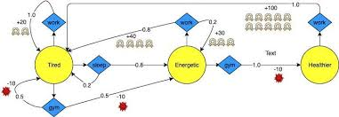

# Reinforcement Learning Labs
**Dynamic Programming, Online Control, Bandits, and Parametric Bandits**



## About
This repository contains the notebooks and support code used for the Reinforcement Learning labs at Institut Polytechnique de Paris.

The progression is intentionally pedagogical:

1. start with exact methods when the model is known and the state space is small,
2. move to online learning when the model is unknown,
3. study exploration vs exploitation in bandits,
4. finish with a simple recommender system based on parametric bandits.

The goal is not only to run algorithms, but to understand what each method optimizes, when it is applicable, and what its mathematical assumptions are.

## General Framework
Most notebooks rely on the Markov Decision Process framework:

- states $$s \in \mathcal{S}$$
- actions $$a \in \mathcal{A}$$
- transition law $$P(s' \mid s, a)$$
- reward $$R(s')$$ or $$R(s, a, s')$$
- discount factor $$\gamma \in [0, 1]$$

The objective is to maximize the expected discounted return

$$
G_t = \sum_{k \geq 0} \gamma^k R_{t+k+1}.
$$

The repository then studies four regimes:

- known model + small state space -> dynamic programming
- unknown model + repeated interaction -> online control
- single-state decision problem -> multi-armed bandits
- bandits with item features -> parametric/contextual bandits

## Notebook Overview

### 1. [1-dynamic.ipynb](1-dynamic.ipynb)
**Topic:** dynamic programming on small MDPs and games.

**Main objective:** compute value functions and optimal policies when the full model is available.

**What the notebook does**

- introduces simple environments such as grid walks and board games,
- evaluates a fixed policy,
- improves the policy with greedy updates,
- compares policy iteration and value iteration.

**Mathematical core**

For a fixed policy $$\pi$$, the value function satisfies Bellman's equation:

$$
V^\pi(s)
= \sum_a \pi(a \mid s)
\sum_{s'} P(s' \mid s, a)\,\bigl[R(s') + \gamma V^\pi(s')\bigr].
$$

Two classical exact methods are then studied:

- **Policy iteration:** alternate policy evaluation and greedy improvement.
- **Value iteration:** directly iterate the Bellman optimality operator
$$
V_{k+1}(s)
= \max_a \sum_{s'} P(s' \mid s, a)\,\bigl[R(s') + \gamma V_k(s')\bigr].
$$

**Main takeaway**

When the model is known and the state space is manageable, exact dynamic programming gives the cleanest route to optimal decision making.

### 2. [2-control.ipynb](2-control.ipynb)
**Topic:** online control without knowing the model in advance.

**Main objective:** learn from interaction rather than from an explicit transition matrix.

**What the notebook does**

- studies tabular Q-learning,
- studies policy gradient with function approximation,
- compares both approaches on TicTacToe and ConnectFour.

**Mathematical core**

The tabular Q-learning update is of the form

$$
Q(s,a) \leftarrow Q(s,a)
+ \alpha \Bigl[r + \gamma \max_{a'} Q(s',a') - Q(s,a)\Bigr]
$$

which is a stochastic approximation of the Bellman optimality equation for action-values.

The policy-gradient part moves away from tabular values and optimizes a parametrized policy $$\pi_\theta(a \mid s)$$. The underlying idea is to maximize

$$
J(\theta) = \mathbb{E}_\theta[G_0]
$$

through gradient-based updates of the form

$$
\theta \leftarrow \theta + \alpha\, G_t \nabla_\theta \log \pi_\theta(a_t \mid s_t).
$$

**Main takeaway**

- Q-learning is strong on small discrete state spaces.
- Policy-gradient methods become more relevant when the state space is too large for a reliable tabular representation.

### 3. [3-bandits.ipynb](3-bandits.ipynb)
**Topic:** multi-armed bandit algorithms.

**Main objective:** understand exploration vs exploitation in the simplest sequential decision model.

**What the notebook does**

- starts from a basic stochastic multi-armed bandit,
- implements $$\varepsilon$$-greedy exploration,
- implements UCB,
- implements Thompson Sampling,
- compares the methods through regret curves.

**Mathematical core**

In a bandit problem there is only one state. At each round, the learner chooses an arm and receives a random reward. The reference quantity is the regret:

$$
\mathrm{Regret}(T) = T \mu^* - \sum_{t=1}^T r_t
$$

where $$\mu^*$$ is the mean reward of the best arm.

The notebook studies three major exploration principles:

- **$$\varepsilon$$-greedy:** exploit the current best arm most of the time, explore uniformly with probability $$\varepsilon$$.
- **UCB:** choose the arm maximizing
$$
\hat{\mu}(a) + c \sqrt{\frac{\log t}{N_t(a)}}.
$$
- **Thompson Sampling:** sample plausible arm means from a posterior distribution, then act greedily for that sampled model.

**Main takeaway**

Bandits isolate the exploration problem in its purest form, and regret gives a direct way to compare strategies over time.

### 4. [4-parametric.ipynb](4-parametric.ipynb)
**Topic:** parametric bandits for movie recommendation.

**Main objective:** move from anonymous arms to items described by features.

**What the notebook does**

- loads a movie catalogue,
- represents movies by genre-based features,
- defines a latent user preference vector,
- learns preferences offline with logistic regression,
- then learns online with a Bayesian exploration scheme inspired by Thompson Sampling.

**Mathematical core**

Each movie is represented by a feature vector $$x \in \mathbb{R}^d$$, and the binary feedback is $$y \in \{0,1\}$$.

The offline model is logistic regression:

$$
\mathbb{P}(y = 1 \mid x) = \sigma(\theta^\top x)
$$

where

$$
\sigma(z) = \frac{1}{1 + e^{-z}}.
$$

The online part follows the logic:

1. fit $$\theta$$ from the observed likes/dislikes,
2. build a Gaussian approximation around the fitted parameter,
3. sample a plausible parameter vector,
4. recommend the unseen movie with highest sampled score.

This is a simple contextual-bandit idea: use features to generalize from a few observations.

**Main takeaway**

Unlike standard bandits, parametric bandits can transfer information across items through their shared features, which is the key idea behind recommendation systems.

## Support Files

### [model.py](model.py)
Defines the environments and games used in the labs.

- generic `Environment` base class,
- grid environments such as `Walk` and `Maze`,
- game environments such as `TicTacToe`, `Nim`, `ConnectFour`, and `FiveInRow`.

This file contains the state dynamics, available actions, transition laws, rewards, terminal-state logic, and encodings used by the algorithms.

### [dynamic.py](dynamic.py)
Implements exact dynamic-programming tools for small known environments.

- `PolicyEvaluation`
- `PolicyIteration`
- `ValueIteration`

This is the file that translates Bellman equations into matrix-based computations over the full state space.

### [agent.py](agent.py)
Defines reusable agent abstractions.

- `BaseAgent` for policies and action selection,
- `Agent` for episode simulation and return estimation,
- `OnlineEvaluation` and `OnlineControl` for tabular learning with value and action-value tables.

This file is the bridge between abstract environments and learning algorithms.

### [display.py](display.py)
Provides plotting and animation helpers for trajectories and board states.

It is purely a visualization layer: useful for understanding behavior, but separate from the mathematical logic of the algorithms.

## Data Files

- [maze.npy](maze.npy): maze layout used in grid-based experiments.
- [movie_database.pickle](movie_database.pickle): movie catalogue used in the parametric-bandit notebook.

## How To Run

Install the dependencies:

```bash
pip install -r requirements.txt
```

Then open the notebooks with Jupyter:

```bash
jupyter notebook
```

Recommended order:

1. `1-dynamic.ipynb`
2. `2-control.ipynb`
3. `3-bandits.ipynb`
4. `4-parametric.ipynb`

## Dependencies

- numpy
- scipy
- pandas
- matplotlib
- torch
- scikit-learn
- jupyter
- ipywidgets
