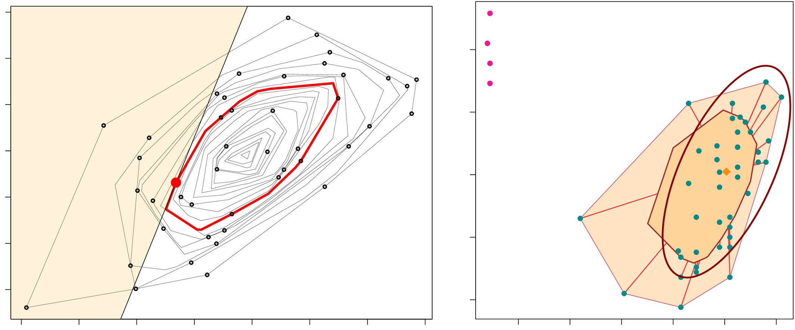

# Data Depth and Depth-Based Classification - Practice & Experiments

**Mahalanobis Depth, Tukey Depth, DD-Plots, Depth-Based Classification & Robustness**

## 1. About

This notebook provides a progressive experimental study of statistical depth functions and their application to multivariate classification.

The objective is not only to implement depth-based methods, but to understand their geometric meaning, their statistical interpretation, and their behavior under different data-generating mechanisms.

We explore:

* the notion of centrality in multivariate data
* the construction of two classical depth functions: Mahalanobis depth and Tukey depth (through a random approximation)
* the use of depth for classification
* the geometry of DD-plots
* the effect of location alternatives and location-scale alternatives
* the robustness of depth-based methods under heavy-tailed distributions such as the multivariate Cauchy

Both Gaussian and heavy-tailed synthetic datasets are used in order to connect the theoretical ideas of data depth with concrete visual and numerical experiments.

## 2. Statistical Learning Setup

We consider a binary classification problem in dimension $d = 2$, where each observation is a vector:

$$\mathbf{x} = (x_1, x_2)^T \in \mathbb{R}^2$$

and belongs to one of two classes.

The main idea of depth-based statistics is the following: instead of representing a point only by its raw coordinates, we measure how central it is with respect to a reference data cloud.

A depth function assigns a score:

$$D(\mathbf{x}|X)$$

which quantifies the centrality of a point $\mathbf{x}$ with respect to a dataset $X$.

**Interpretation:**

* high depth → point close to the center of the distribution
* low depth → point on the boundary or in the tails
* zero depth → point considered outside the cloud

This centrality-based view naturally leads to classification rules:

* assign a point to the class where it is deepest
* or use the pair of class depths as new coordinates in a DD-plot

## 3. Gaussian Models and Geometric Structure

### 3.1 Three Gaussian Configurations

We first generate synthetic datasets from three bivariate Gaussian distributions:

* **MVN1**: centered at $(0, 0)$, with covariance $\Sigma = \begin{bmatrix} 1 & 1 \\ 1 & 4 \end{bmatrix}$
* **MVN2**: centered at $(2, 2)$, with the same covariance as MVN1
* **MVN3**: centered at $(2, 2)$, with larger covariance $\Sigma = \begin{bmatrix} 4 & 4 \\ 4 & 16 \end{bmatrix}$

These three models are used to study two important situations:

* location alternative: same shape, different centers
* location-scale alternative: different center and different spread

This distinction is essential, because depth-based methods react differently when classes differ only by position versus when they also differ by dispersion.

### 3.2 Why These Gaussian Examples Matter

Gaussian clouds provide a clean setting where geometry is easy to interpret.

They allow us to visualize:

* the center of a distribution
* the effect of covariance on cloud shape
* how centrality changes from the middle of the cloud to the boundary
* how depth behaves when the two classes overlap partially

This makes them the natural first step before moving to more difficult heavy-tailed distributions.

## 4. Mahalanobis Depth - Elliptical Centrality

The first depth notion studied in the notebook is the Mahalanobis depth:

$$D_M(\mathbf{x}|X) = \frac{1}{1 + (\mathbf{x} - \boldsymbol{\mu}_X)^T \Sigma_X^{-1} (\mathbf{x} - \boldsymbol{\mu}_X)}$$

where:

* $\boldsymbol{\mu}_X$ is the empirical mean of the reference sample
* $\Sigma_X$ is the empirical covariance matrix

This depth is directly built from the Mahalanobis distance, which measures how far a point is from the center after correcting for the scale and orientation of the cloud.

This is important because in multivariate data, not all directions should be treated equally:

* being far in a direction where the data naturally spread a lot is less surprising
* being far in a tight direction is much more atypical

So Mahalanobis depth defines centrality with respect to the elliptical geometry of the data.

**Main properties:**

* central points have depth close to 1
* peripheral points have smaller depth
* the depth is smooth and continuous
* it is well adapted to elliptical distributions, especially Gaussian ones

**Limitation:** Mahalanobis depth depends on the empirical mean and covariance matrix, and is therefore sensitive to outliers and heavy-tailed data.

## 5. Tukey Depth - Geometric Depth via Halfspaces

The second notion studied is the Tukey depth, also called halfspace depth.

Its idea is more geometric: a point is deep if it is difficult to separate from the data cloud by a hyperplane.

Equivalently, a point is central if, in every direction, a substantial portion of the data remains on both sides of it.

In full generality, computing Tukey depth can be expensive. In this notebook, it is approximated using the projection property:

1. Generate random directions uniformly on the unit sphere
2. Project both the data and the query point onto each direction
3. Compute a univariate depth on the projected sample
4. Take the minimum over all directions

This yields the random Tukey depth.

**Why it is interesting:**

Compared with Mahalanobis depth, Tukey depth is:

* more geometric
* less tied to covariance estimation
* conceptually more robust

**Practical limitation:** Its numerical value depends on the number of random directions used in the approximation. With a small number of directions, the approximation may be noisy or unstable.

## 6. Visualizing Depth on the Data Clouds

For each Gaussian sample, both Mahalanobis depth and random Tukey depth are computed with respect to the sample itself, and the values are displayed next to the points.

This stage is essential because it makes the notion of depth concrete.

It shows that:

* points near the center of the cloud receive larger depth values
* points on the boundary receive smaller values
* Tukey depth often appears more discrete in finite samples
* Mahalanobis depth follows the global elliptical structure more smoothly

This first set of plots transforms depth from an abstract formula into a visible and interpretable notion of multivariate centrality.

## 7. Maximum Depth Classification

### 7.1 Principle

The first classifier implemented in the notebook is the maximum depth classifier.

For a new point $\mathbf{x}$, we compute its depth with respect to each class:

$$D(\mathbf{x}|\text{Class } 0), \quad D(\mathbf{x}|\text{Class } 1)$$

and assign it to the class for which the depth is maximal.

This leads to a very natural decision rule: a point should belong to the class in which it appears most central.

### 7.2 Outsiders and 1NN Correction

A practical issue arises when a point has zero depth with respect to all classes. Such a point is called an outsider.

In that case, depth no longer provides a meaningful comparison. To handle this, the notebook uses a fallback rule based on 1-nearest neighbors (1NN) in the original space.

This hybrid strategy combines:

* a geometric classification rule based on depth
* a local distance-based correction for observations lying outside both class supports

### 7.3 Location Alternative: MVN1 vs MVN2

The maximum depth classifier is first tested on a dataset with:

* 250 points from MVN1
* 250 points from MVN2

Since these two classes mainly differ by their centers, this is the most favorable situation for depth-based classification.

The training set is plotted, and the error rate on the test set is reported. This experiment illustrates how depth naturally captures class membership when the classes differ mostly by location.

## 8. DD-Plots - A New Representation for Classification

One of the central ideas of the notebook is the DD-plot.

Given two classes, each point $\mathbf{x}$ is transformed into:

$$\mathbf{x} \mapsto (D(\mathbf{x}|\text{Class } 0), D(\mathbf{x}|\text{Class } 1))$$

This means that we replace raw coordinates $(x_1, x_2)$ by a pair of depth coordinates.

**Why this is powerful:**

The DD-plot turns a multivariate classification problem into a 2-dimensional one in the space of centralities.

A point in DD-space tells us immediately:

* how central it is in class 0
* how central it is in class 1

This often reveals class structure more clearly than the original feature space.

### 8.1 DD-Plot under a Location Alternative

For the dataset built from MVN1 and MVN2, the DD-plot is constructed using Mahalanobis depth.

Since the two classes have similar shape but different centers, the DD representation tends to separate the classes meaningfully:

* class-0 points tend to have higher depth with respect to class 0
* class-1 points tend to have higher depth with respect to class 1

This confirms that depth coordinates are informative when the classes differ mainly by location.

### 8.2 DD-Plot under a Location-Scale Alternative

A second DD-plot is built for a dataset made of:

* 250 points from MVN1
* 250 points from MVN3

This is a harder setting because one class is much more spread out.

Here, depth behaves differently:

* a point from the high-variance class may still have modest depth within its own class
* the distinction between "belonging to the class" and "being central in the class" becomes less direct

This experiment shows an important limitation of simple depth comparison: when class dispersions differ strongly, depth alone may become less discriminative.

## 9. DD-kNN Classification

The notebook then introduces a second classifier: the DD-kNN classifier.

Instead of classifying directly in the original space, we:

1. Compute the DD representation of each point
2. Apply k-nearest neighbors in DD-space
3. Classify outsiders using 1NN in the original space

This classifier is more flexible than the maximum depth rule because it does not rely only on comparing two scalar depths. It can learn more complex local structures in the DD representation.

The DD-kNN classifier is applied to the MVN1 vs MVN3 dataset, and its performance is compared to that of the maximum depth classifier.

This comparison highlights the distinction between:

* a simple decision rule based on maximal centrality
* a more adaptive classifier operating in depth-transformed space

## 10. Heavy-Tailed Data - Multivariate Student and Cauchy

To test robustness, the notebook moves beyond Gaussian data and introduces the multivariate Student-t distribution.

A random vector $\mathbf{X} \in \mathbb{R}^d$ is generated as:

$$\mathbf{X} = \boldsymbol{\mu} + \sqrt{\frac{\nu}{W_\nu}} \mathbf{Z}$$

where:

* $\mathbf{Z} \sim N(\mathbf{0}, \Sigma)$
* $W_\nu \sim \chi^2_\nu$
* $\mathbf{Z}$ and $W_\nu$ are independent

The special case $\nu = 1$ corresponds to the multivariate Cauchy distribution.

This family is particularly useful because it introduces heavy tails, meaning that large outliers occur much more frequently than in the Gaussian case.

### 10.1 Why Heavy Tails Matter

Heavy-tailed distributions are a serious challenge for depth methods, especially those based on moments.

In particular:

* Mahalanobis depth depends on empirical mean and covariance
* these quantities are highly unstable in the presence of extreme observations
* the geometry of the cloud may therefore be badly distorted

Tukey depth, by contrast, is more geometric and does not rely directly on covariance estimation. This suggests that it may behave more robustly in heavy-tailed settings.

### 10.2 Cauchy Samples and Visual Evidence

Two Cauchy datasets are generated:

* MVC1: same parameters as MVN1
* MVC2: center shifted to $(1, 1)$, same scatter matrix

The corresponding scatter plots show immediately what heavy tails mean in practice:

* most points still form a central cloud
* but a few observations can appear extremely far away
* these extreme values change the scale of the plots dramatically

This makes the robustness issue visible before classification is even attempted.

## 11. DD-Plots under Heavy Tails

A binary dataset is then built from:

* 250 points from MVC1
* 250 points from MVC2

For the training set, two DD-plots are produced:

* one based on Mahalanobis depth
* one based on random Tukey depth with 100 directions

This comparison is central to the notebook, because it shows how the geometry of DD-space changes when the data are no longer Gaussian.

Under heavy tails:

* class overlap becomes stronger
* a few extreme points can heavily influence moment-based depth
* the separation in DD-space becomes less clean

## 12. Comparison of Depth-Based DD Classifiers

Finally, the notebook compares two DD-kNN classifiers on the Cauchy dataset:

* DD-kNN with Mahalanobis depth
* DD-kNN with random Tukey depth (100 directions)

**Reported test error rates:**

* Mahalanobis depth: 0.3680
* Random Tukey depth: 0.3920

These results should be interpreted carefully.

The Mahalanobis-based classifier performs slightly better on this particular run, but the difference remains small. More importantly, both error rates are relatively high, which confirms that classification under heavy-tailed distributions is significantly more difficult than under Gaussian models.

This final experiment shows that:

* robustness is not just about theoretical properties
* approximation quality, sample randomness, and class overlap all matter
* heavy-tailed settings expose the limits of simple depth-based classification rules

## 13. Core Takeaways

* Statistical depth provides a geometric notion of centrality for multivariate data
* Mahalanobis depth is simple and effective for elliptical Gaussian-like clouds, but it is sensitive to outliers because it relies on empirical mean and covariance
* Tukey depth is more geometric and conceptually more robust, but its random approximation depends on the number of directions used
* Maximum depth classification is intuitive and natural when classes differ mainly by location
* DD-plots provide an elegant transformation of a multivariate classification problem into a two-dimensional depth space
* DD-kNN extends this idea by learning local decision rules in that transformed space
* Location-scale differences and heavy-tailed distributions make the classification problem much harder
* Cauchy experiments reveal both the promise and the limitations of depth-based methods in non-ideal settings

## 14. Dependencies

* numpy
* matplotlib
* scikit-learn
---
***Alexandre Mathias DONNAT, Sr***

