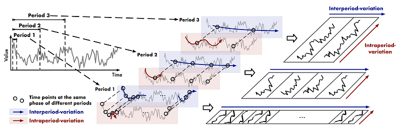

# Deep Learning for Financial Time Series Forecasting 

**Baselines, MLP, Patch-Based Transformers, Multivariate Signals & Model Comparison**

## 1. About

This lab studies short-term financial time series forecasting using daily Yahoo Finance data, with a focus on comparing simple baselines and neural forecasting models.

The objective of this lab is not only to train forecasting models, but to understand when model complexity is justified and when it is not.

The objectives of this lab are to:

- Build a clean multistep forecasting pipeline on financial time series
- Construct a multivariate dataset from raw market and calendar variables
- Compare naive baselines with learned neural models
- Study the difference between univariate and multivariate forecasting
- Analyze generalization through train/validation/test splits
- Interpret forecasting errors in a noisy and weakly predictable domain
- Understand why transformer-style models may fail on financial data

The work is organized in progressive steps:

Data collection from Yahoo Finance. Feature engineering for AAPL and external market variables. Temporal train/validation/test split. Multistep window construction. Baseline forecasting. Multivariate MLP forecasting. PatchTST-like forecasting in univariate and multivariate settings. Model comparison using MAE and RMSE. Visual forecast analysis. Horizon-wise error analysis. Critical interpretation and methodological conclusions.

## 2. Learning Problem Setup

We consider a multistep time series forecasting problem.

The target variable is the future closing price of Apple:

$$y_t = \text{AAPL Close}_t$$

At each time $t$, the model receives a context window of past observations and must predict the next $H$ future values.

The input is therefore a temporal block:

$$X_t \in \mathbb{R}^{L \times C}$$

where:

- $L$ = context length
- $C$ = number of input channels or features

The output is:

$$Y_t \in \mathbb{R}^H$$

where $H$ is the prediction horizon.

In this notebook, we use:

- context length = 60 days
- prediction length = 5 days

So the task is:

Use the previous 60 trading days to predict the next 5 AAPL closing prices.

## 3. Financial Dataset Construction

The dataset is built from Yahoo Finance and combines three market sources:

- AAPL → target asset
- ^GSPC → S&P 500 index, used as a proxy for the broad equity market
- ^VIX → volatility index, used as a proxy for market stress and implied uncertainty

The final dataset is multivariate and includes:

Intrinsic AAPL variables:
- Open, High, Low, Close, Volume

Engineered AAPL features:
- returns, log-returns, high-low spread, open-close spread, rolling averages, rolling volatility

External market variables:
- S&P 500 level and return, VIX level and return

Calendar variables:
- day-of-week and month encodings via sin/cos transformations

This setup allows us to move beyond a naive univariate forecasting problem and test whether external information improves prediction.

## 4. Temporal Forecasting Protocol

Because this is a time series problem, chronology must be respected.

The data are split as follows:

- Train = 70%
- Validation = 15%
- Test = 15%

No shuffling is performed.

A standardization step is then applied:

- feature scaler fitted on the training set only
- target scaler fitted on the training set only

This avoids leakage from future data into training.

The time series is then transformed into supervised learning windows:

$$X_t = [x_{t-L}, \ldots, x_{t-1}]$$
$$Y_t = [y_t, \ldots, y_{t+H-1}]$$

This converts the forecasting task into a standard supervised learning problem.

## 5. Baseline Forecasting Models

Before training neural models, two simple baselines are defined.

### 5.1 Last-Value Baseline

The model predicts that all future values are equal to the last observed AAPL closing price in the context window.

Formally:

$$\hat{y}_{t+h} = y_{t-1}, \quad \text{for } h = 1, \ldots, H$$

This is a persistence model.

### 5.2 Context-Mean Baseline

The model predicts that all future values are equal to the mean closing price over the context window.

Formally:

$$\hat{y}_{t+h} = \frac{1}{L} \sum_{i=1}^L y_{t-i}, \quad \text{for } h = 1, \ldots, H$$

These baselines are crucial because they define the minimum performance level that any learned model must exceed to be considered useful.

## 6. Multilayer Perceptron (MLP)

### 6.1 Model

The first learned model is a multivariate MLP.

The full input window is flattened into a single vector:

$$X_t \in \mathbb{R}^{L \times C} \rightarrow \text{vec}(X_t) \in \mathbb{R}^{L \cdot C}$$

This vector is passed through a feedforward neural network with hidden layers and nonlinear activations.

The output is a direct 5-step forecast:

$$\hat{y}_t \in \mathbb{R}^H$$

### 6.2 Role of the MLP

The MLP does not explicitly model temporal ordering like a recurrent or transformer model.

Instead, it learns a nonlinear mapping from the past window to the future horizon.

It serves as a useful benchmark because:

- it is more flexible than linear baselines
- it is simpler than transformer-based architectures
- it can exploit multivariate interactions without excessive architectural complexity

## 7. PatchTST-like Forecasting Models

### 7.1 Core Idea

PatchTST is based on the idea that a time series can be split into patches instead of being processed point by point.

Rather than feeding the full raw sequence directly into a transformer, we divide the temporal window into overlapping subsegments.

Each patch is embedded and processed by a transformer encoder.

This allows the model to learn relationships between local temporal patterns.

### 7.2 Univariate PatchTST-like Model

In the univariate setting, only the AAPL closing price is used:

$$X_t \in \mathbb{R}^{L \times 1}$$

The goal is to test whether a transformer-style patch representation can learn useful patterns from the price series alone.

### 7.3 Multivariate PatchTST-like Model

In the multivariate setting, all engineered features are used:

$$X_t \in \mathbb{R}^{L \times C}$$

The goal is to test whether a transformer-style model benefits from additional market and calendar information.

### 7.4 Important Note

This notebook uses a lightweight PatchTST-inspired implementation, not the full original research architecture.

So the purpose is educational and comparative: to study the behavior of a patch-based transformer on financial forecasting, not to claim an exact reproduction of the official model.

## 8. Evaluation Metrics

The models are evaluated using:

- MAE = Mean Absolute Error
- RMSE = Root Mean Squared Error

These metrics are computed on the test set after inverse transformation back to the original price scale.

The comparison is made across:

- Baseline - Last Value
- Baseline - Context Mean
- MLP - Multivariate
- PatchTST-like - Univariate
- PatchTST-like - Multivariate

A horizon-wise MAE analysis is also performed to study error progression from forecast step 1 to step 5.

## 9. Main Empirical Results

The final ranking obtained in this lab is:

1. Baseline - Last Value: MAE = 5.03, RMSE = 7.22
2. MLP - Multivariate: MAE = 8.62, RMSE = 10.96
3. Baseline - Context Mean: MAE = 12.60, RMSE = 15.64
4. PatchTST-like - Univariate: MAE = 51.68, RMSE = 56.05
5. PatchTST-like - Multivariate: MAE = 78.79, RMSE = 82.13

These results lead to one very clear conclusion: the best-performing method is the naive last-value baseline.

## 10. Interpretation of the Results

### 10.1 Why does the last-value baseline win?

This is a short-horizon daily forecasting task on stock prices.

Over such horizons, prices often remain close to their latest observed value unless strong news or a regime shift occurs.

So a persistence forecast is already very hard to beat.

### 10.2 Why is the MLP reasonably competitive?

The MLP captures some structure from the multivariate window and clearly outperforms the context-mean baseline.

However, it still fails to beat the persistence baseline.

This means it learns a partial signal, but not enough to justify replacing the naive forecast.

### 10.3 Why do the PatchTST-like models fail?

The transformer-style models show very low training loss but high and unstable validation loss.

This indicates strong overfitting.

The prediction plots also show that they forecast the wrong price level entirely:
- the univariate version predicts values around the low 180s
- the multivariate version predicts values around the 130–140 range
- while the true prices are around 210–220

So the issue is not a small forecast deviation. The models fail more fundamentally to generalize.

### 10.4 Why does multivariate PatchTST-like perform even worse?

Adding more variables can help only if those variables carry stable predictive information.

Here, the added inputs likely introduce more noise than usable signal.

So the multivariate setup increases model complexity without improving generalization.

## 11. Core Takeaways

- Short-horizon financial forecasting is extremely difficult because the signal-to-noise ratio is low.
- A naive persistence model can be a very strong benchmark.
- More complex models do not automatically outperform simple baselines.
- Multivariate information is only useful when it is genuinely informative and stable.
- Transformer-style forecasting models may work well on structured domains such as energy or weather, but can fail badly on noisy financial data.
- Proper temporal splitting, leakage control, and baseline comparison are essential for honest forecasting evaluation.

## 12. Dependencies

- numpy
- pandas
- matplotlib
- scikit-learn
- torch
- yfinance
---
***Alexandre Mathias DONNAT, Sr***