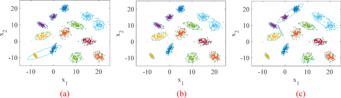

# Clustering Analysis – Practice & Experiments

**Partitioning Methods, Probabilistic Mixtures & Hierarchical Structures**

## About

This repository presents a structured and mathematically grounded exploration of clustering methods through three complementary notebooks.

The objective is not only to apply clustering algorithms, but to understand their geometric, probabilistic and hierarchical foundations, and to compare them through rigorous evaluation metrics.

Rather than treating clustering as a black-box task, the notebooks emphasize:

- The geometry of partitioning algorithms
- The probabilistic interpretation of mixture models
- The structure revealed by dendrogram-based methods
- The role of external and internal validation metrics

The experiments are conducted on three datasets of increasing structural complexity:

- The Iris dataset (Euclidean feature space)
- The Karate Club network (graph structure)
- The Wikischools corpus (high-dimensional textual data)

## Mathematical Framework

Let $X = \{x_1, \ldots, x_n\}$, $x_i \in \mathbb{R}^d$ be a dataset of $n$ observations in $d$-dimensional space.

Clustering consists in partitioning the data into $K$ groups:

$$C = \{C_1, \ldots, C_K\}$$

such that intra-cluster similarity is maximized and inter-cluster similarity is minimized.

Three complementary paradigms are explored.

### Partition-Based Clustering (K-Means)

K-means solves:

$$\min_{C_1, \ldots, C_K} \sum_{k=1}^{K} \sum_{x_i \in C_k} \|x_i - \mu_k\|^2$$

where $\mu_k = \frac{1}{|C_k|} \sum_{x_i \in C_k} x_i$

This corresponds to minimizing within-cluster variance under Euclidean geometry.

My interpretation:
- Assumes spherical clusters
- Equal variance across clusters
- Hard assignments

### Probabilistic Clustering (Gaussian Mixture Models)

In GMM, data is modeled as a mixture distribution:

$$p(x) = \sum_{k=1}^{K} \pi_k \mathcal{N}(x | \mu_k, \Sigma_k)$$

Parameters are estimated via Expectation-Maximization (EM).

Main properties:
- Soft probabilistic assignments
- Flexible covariance structures (spherical, diagonal, full)
- Explicit likelihood maximization

This framework generalizes K-means: K-means corresponds to a special case of GMM with spherical covariances and equal variances.

### Hierarchical Clustering

Hierarchical clustering builds a nested structure of partitions using a linkage criterion.

Ward's method minimizes the increase in within-cluster variance at each merge:

$$\Delta(C_i, C_j) = \frac{|C_i||C_j|}{|C_i| + |C_j|} \|\mu_i - \mu_j\|^2$$

The output is a dendrogram representing successive merges.

Unlike K-means:
- No fixed number of clusters required a priori
- Reveals multi-scale structure
- Provides interpretable height gaps

## Evaluation Metrics

Two types of validation are systematically used.

### Internal validation (no ground truth)

Silhouette score:

$$s(i) = \frac{b(i) - a(i)}{\max(a(i), b(i))}$$

where:
- $a(i)$: average intra-cluster distance
- $b(i)$: minimum average inter-cluster distance

Measures separation and compactness.

### External validation (with ground truth)

- Adjusted Rand Index (ARI)
- Adjusted Mutual Information (AMI)

Both correct for chance agreement and allow principled comparison between predicted clusters and true labels.

## Repository Structure

### Notebook 1 – Clustering Metrics on Iris

**Focus:**
- Silhouette analysis
- Contingency matrices
- ARI / AMI evaluation
- Selection of optimal $K$

This notebook establishes the evaluation framework and highlights the gap between internal and external validation criteria.

### Notebook 2 – K-Means vs Gaussian Mixture

**Focus:**
- Geometric vs probabilistic clustering
- Covariance constraints (spherical, diagonal)
- Sensitivity to feature scaling
- Robustness comparison via ARI / AMI

**Insight:** K-means assumes isotropic geometry, whereas GMM adapts to covariance structure. Scaling can drastically affect partitioning behavior.

### Notebook 3 – Hierarchical Clustering & Graph Data

**Focus:**
- Dendrogram analysis
- Optimal cut selection via height gaps
- Comparison with K-means
- Spectral embedding for graph clustering

**Datasets:**
- Iris (Euclidean)
- Karate Club (network structure)
- Wikischools (high-dimensional text graph)

Hierarchical clustering reveals multi-resolution structure, particularly powerful when combined with spectral embeddings in graph settings.

## My methodological Perspective

This repository emphasizes:

- The geometric interpretation of clustering objectives
- The probabilistic meaning of mixture models
- The relationship between linkage criteria and variance minimization
- The complementarity between internal and external metrics
- The importance of scaling and covariance assumptions

Rather than focusing solely on algorithmic execution, the notebooks aim to build structural understanding of clustering as an optimization problem, a probabilistic modeling framework, and a hierarchical organization of data geometry.

## Dependencies

- numpy
- pandas
- matplotlib
- seaborn
- scikit-learn
- scipy
- scikit-network

Datasets included via scikit-learn and scikit-network.

---

Alexandre Mathias DONNAT, Sr
