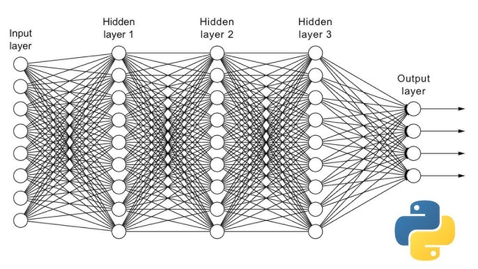

# Deep Learning with PyTorch - Multilayer Perceptron (MLP)
**Multi-Class Classification on Tabular Data**




## About

This notebook provides a hands-on introduction to training a Multilayer Perceptron (MLP) using PyTorch for a multi-class classification problem on real-world tabular data.

The objective is to understand how a neural network is built, trained, evaluated, and regularized in practice, rather than treating deep learning models as black boxes. The notebook follows a structured pipeline, from raw data loading to model evaluation and early stopping.

The Dry Bean Dataset is used as a realistic benchmark, combining computer vision–derived features with a supervised learning task involving seven classes.

## Learning Problem Setup

We consider a supervised multi-class classification problem.

Each observation corresponds to a single dry bean described by 16 numerical features extracted from image-based shape and geometry measurements. The target variable is the bean class among 7 possible categories.

Formally, the dataset consists of pairs:

$$
(x_i, y_i), \quad x_i \in \mathbb{R}^{16}, \quad y_i \in \\{0, \dots, 6\\}
$$

The model outputs class scores (logits), and training is performed by minimizing the categorical cross-entropy loss.

## Data Acquisition and Preprocessing

The Dry Bean Dataset is downloaded from the UCI Machine Learning Repository.

Preprocessing steps include:

- Loading the dataset from an Excel file using pandas
- Splitting features ($X$) and labels ($y$)
- Encoding class labels into integers using `LabelEncoder`
- Train/validation split (80% / 20%) with stratification
- Feature standardization using `StandardScaler`

This step ensures that the data is numerically well-conditioned for neural network training.

## PyTorch Dataset and DataLoader

To integrate the data into PyTorch, a custom `Dataset` class is implemented. It:

- Converts NumPy arrays into PyTorch tensors
- Provides indexed access to samples and labels

The `DataLoader` abstraction is then used to handle:

- Mini-batch training
- Data shuffling for the training set
- Efficient iteration during training and evaluation

## MLP Architecture

The neural network is implemented using `nn.Module` with the following architecture:

```
input_dim → 128 → 64 → 64 → output_dim
```

- ReLU activations are used between hidden layers
- The output layer produces raw logits (no softmax)
- Softmax is implicitly handled by `CrossEntropyLoss`

This architecture is well-suited for tabular classification problems with moderate dimensionality.


## Training and Optimization

The model is trained using:

- **CrossEntropyLoss**, combining softmax and categorical cross-entropy
- **Adam optimizer** with a learning rate of 0.001

A full training loop is implemented, including:

- Forward pass
- Loss computation
- Backpropagation
- Parameter updates
- Accuracy computation

Training and validation loss/accuracy are tracked at each epoch.

## Model Evaluation and Early Stopping

To prevent overfitting, early stopping is introduced by monitoring the validation loss. Training stops when the validation loss no longer improves for several consecutive epochs (patience-based criterion).

Loss and accuracy curves are plotted to visualize:

- Convergence behavior
- Generalization performance
- The effect of early stopping on training duration

The model achieves stable validation accuracy around **92–93%**, indicating good generalization.

## Core takeaways

- Neural networks can be effectively applied to tabular data with proper preprocessing.
- PyTorch's `Dataset` and `DataLoader` abstractions simplify real-world data pipelines.
- Cross-entropy loss and logits-based outputs are standard for multi-class classification.
- Comparing training and validation curves is essential to detect overfitting.
- Early stopping provides a simple and effective regularization strategy.

## Dependencies

- numpy
- pandas
- matplotlib
- scikit-learn
- torch (PyTorch)

---

***Alexandre Mathias DONNAT, Sr***
