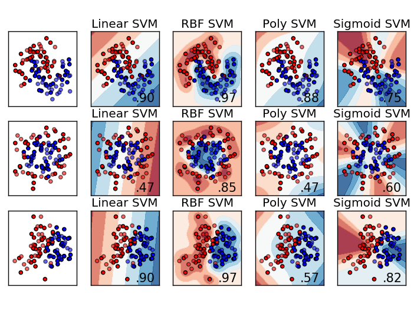

# Support Vector Machines (SVM) - Practice & Experiments  
**Linear vs Non-Linear Models, Regularization, Kernels, Generalization & Complexity**

## 1. About

This notebook provides a comprehensive experimental study of **Support Vector Machines (SVMs)** for binary classification.

The goal is not only to apply SVMs, but to **understand their geometric, statistical, and optimization properties**, through a progressive set of controlled experiments.

We explores:

- Linear and non-linear decision boundaries
- The role of regularization and kernel parameters
- Generalization vs overfitting
- Learning curves and Bayes optimal performance
- The effect of noise and nuisance variables
- SVM behavior in high-dimensional real-world data (face recognition)

Both **synthetic datasets** (with known distributions) and a **real image dataset (LFW)** are used to connect theory with practice.

## 2. Learning Problem Setup

We consider a **binary classification problem** with labels:

$$
y \in \{0, 1\} \quad \text{or} \quad y \in \{-1, +1\}
$$

Each observation is a feature vector:

$$
x = (x_1, \dots, x_p)^\top \in \mathbb{R}^p
$$

An SVM learns a decision function of the form:

$$
f(x) = \langle w, \Phi(x) \rangle + b
$$

where:
- $\Phi$ is a (possibly implicit) feature mapping,
- the predicted label is given by $\text{sign}(f(x))$.

The learning objective is to find a classifier that:
- separates the classes with **maximum margin**,
- while allowing controlled violations when perfect separation is impossible.

## 3. Linear SVM - Geometry and Regularization

### 3.1 Linearly Separable Gaussian Classes

We first generate synthetic datasets from **Gaussian distributions** using `make_blobs`, allowing full control over class separability.

This setting enables:
- visualization of margins and decision boundaries,
- direct interpretation of support vectors,
- clean separation of training and test performance.

### 3.2 Bayes Risk Estimation (Monte Carlo)

Since the data-generating distributions are known, we estimate the **Bayes risk**, i.e. the **minimum achievable classification error**, using Monte Carlo simulation.

This provides:
- an absolute performance reference,
- a way to distinguish model limitations from irreducible uncertainty.

## 4. Effect of the Regularization Parameter C

The soft-margin SVM objective is:

$$
\frac{1}{2}\|w\|^2 + C \sum_{i=1}^n [1 - y_i f(x_i)]_+
$$

The parameter **C** controls the trade-off between:
- margin maximization (model simplicity),
- training error minimization.

By varying C, we observe:
- changes in margin width,
- evolution of the number of support vectors,
- impact on train/test accuracy.

Cross-validation is used to select an optimal value $C^*$ in overlapping (non-separable) settings.

## 5. Overfitting with Non-Linear Kernels

We then introduce the **Gaussian (RBF) kernel**, whose flexibility is controlled by:

- **C**: regularization strength,
- **γ (gamma)**: kernel locality / model complexity.

By jointly varying $(C, \gamma)$, we demonstrate:
- perfect training accuracy with overly flexible models,
- severe overfitting when hyperparameters are not controlled,
- the necessity of validation procedures.

## 6. Non-Linear Classification Problems

We construct intrinsically **non-linearly separable datasets** (e.g. class-0 / class-1 / class-0 structures).

This highlights: the failure of linear SVMs due to high bias, the ability of RBF SVMs to capture non-linear structure, the geometric meaning of kernels as implicit feature embeddings.

Decision boundaries are explicitly visualized for comparison.

## 7. Learning Curves and Bayes Optimality

With fixed hyperparameters, we study **learning curves**:

- training accuracy vs dataset size,
- test accuracy vs dataset size,
- comparison with Bayes optimal accuracy.

This analysis illustrates:
- the bias–variance trade-off,
- diminishing returns when adding data,
- convergence toward the Bayes limit.

## 8. Error vs Model Complexity under Label Noise

To study robustness, **label noise** is introduced by randomly flipping training labels.

We then analyze:
- training error vs complexity,
- test error vs complexity,
- number of support vectors as a proxy for model capacity.

Results show:
- decreasing training error with increasing complexity,
- U-shaped test error curves,
- explicit overfitting to noise in highly flexible models.

This experiment clearly demonstrates why **more complex models are not always better**.

## 9. Bonus 1 :  Face Classification (LFW Dataset)

### 9.1 Binary Face Recognition

We apply SVMs to a real high-dimensional dataset: **Labeled Faces in the Wild (LFW)**.

Pixels are treated as features, leading to extremely high dimensional input spaces.

### 9.2 Regularization Effects

By varying C, we study: generalization behavior in high dimension, sensitivity to over- and under-regularization.

### 9.3 Effect of Nuisance Variables

Random (uninformative) features are added to the data.

This illustrates: the curse of dimensionality, how irrelevant dimensions degrade performance, why regularization alone is insufficient in very high dimension.

### 9.4 Non-Linear Kernels and PCA

Applying an RBF kernel directly on raw pixels performs poorly.

After dimensionality reduction via **PCA**: distances become meaningful again, non-linear kernels significantly improve performance.

This highlights the importance of **representation learning** before applying flexible models.

## 10. Bonus 2 : Optimization Perspective

We show that the soft-margin SVM can be rewritten as an unconstrained optimization problem using the hinge loss:

$$
[1 - y f(x)]_+
$$

- the hinge loss is a **convex upper bound** of the 0–1 classification loss,
- convexity makes optimization tractable,
- margin-based penalties improve robustness and generalization.

## 11. Core takeaways

SVMs balance margin maximization and error minimization. The regularization parameter **C** controls robustness vs fit. Kernel parameters (γ) directly govern model complexity.   Non-linear models can overfit easily without validation. Bayes risk provides a fundamental performance ceiling. Learning curves diagnose data vs model limitations. Noise and nuisance variables expose overfitting mechanisms. In high dimension, representation (e.g. PCA) is crucial. SVM optimization relies on convex surrogate losses.

## 12. Dependencies

- `numpy`
- `matplotlib`
- `scikit-learn`
- `scipy`

---
**Alexandre Mathias DONNAT, Sr** 

