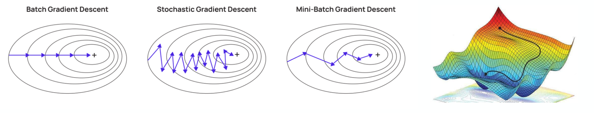

# Stochastic Gradient Descent for Binary Classification  
**Quadratic Loss, Hinge Loss, Regularization, Polyak-Ruppert Averaging & Comparison with Scikit-Learn**

## 1. About

This paper implements and studies **Stochastic Gradient Descent (SGD)** for binary classification in a linear setting.

The objectives of this lab are to:

- Understand the mathematical formulation of empirical risk minimization
- Implement SGD from scratch for different loss functions
- Study the influence of optimization hyperparameters
- Explore practical variants of SGD (averaging, burn-in, regularization)
- Apply the algorithm to both synthetic and real datasets
- Validate the implementation by comparison with Scikit-Learn

The work is organized in two phases:

- **Synthetic data** to study convergence properties in a controlled setting  
- **Real data (Iris dataset)** to illustrate classification behavior in practice

## 2. Learning Problem Setup

We consider a **binary classification** problem with labels:

$$y \in {-1, +1}$$

Each observation is a feature vector:

$$x = (x_1, \dots, x_p)^\top \in \mathbb{R}^p$$

We work with a **linear model**:

$$\hat{h}_w(x) = w^\top x \quad \text{(bias absorbed via an additional constant feature)}$$

Given a training set:

$$D_n = {(x_i, y_i)}_{i=1}^n$$

we aim to minimize the **empirical risk**:

$$\frac{1}{n}\sum_{i=1}^n \ell(\hat{h}_w(x_i), y_i)$$

possibly augmented with an L2 regularization term.

## 3. Stochastic Gradient Descent (SGD)

### 3.1 Principle

SGD is an optimization algorithm designed to minimize an objective function written as a sum over data points.

At each iteration:

1. A single data point $(x_i, y_i)$ is drawn **uniformly at random**
2. The gradient of the loss with respect to $w$ is computed **on this point only**
3. The parameters are updated in the direction of **negative gradient**

$$w_{t+1} = w_t - \gamma_t \nabla f_i(w_t)$$

where:

- $\gamma_t$ is the learning rate (step size)
- $T$ is the number of iterations

The randomness comes from the **sampling of data points**, not from the descent direction itself.

## 4. Loss Functions Studied

### 4.1 Quadratic Loss (MSE)

$$\ell_{\text{mse}}(h,y) = \frac{(h - y)^2}{2}$$

- Naturally suited for regression
- Can be used for classification as a baseline
- Penalizes the numerical distance between prediction and label

The stochastic gradient is:

$$\nabla f_i(w) = (w^\top x_i - y_i)x_i$$

### 4.2 Hinge Loss (Margin-Based Classification)

$$\ell_{\text{hinge}}(h,y) = \max(0, 1 - y h)$$

- Designed specifically for binary classification
- Penalizes misclassified points and points inside the margin
- Correctly classified points with sufficient margin do not contribute

The subgradient is:

$$\nabla f_i(w) = \begin{cases} - y_i x_i & \text{if } y_i h_i < 1 \\\ 0 & \text{otherwise} \end{cases}$$

This loss leads to **margin-maximizing classifiers**, similar to SVMs.

## 5. Variants of SGD Studied

### 5.1 Constant vs Decreasing Step Size

- **Constant step size**: fast initial progress, oscillations near optimum
- **Decreasing step size**: reduced variance and better final convergence, but requires tuning

Typical schedules:

$$\gamma_t = \frac{\gamma_0}{\sqrt{t}}, \quad \gamma_t = \frac{\gamma_0}{t}$$

### 5.2 Averaged SGD

Instead of returning the last iterate $w_T$, we compute:

$$\bar{w}_T = \frac{1}{T}\sum_{t=1}^T w_t$$

Averaging reduces variance and often yields a better final solution.

### 5.3 Burn-in Averaging

To avoid averaging early, highly biased iterates, averaging can start after $t_0$ iterations:

$$\bar{w}_T = \frac{1}{T - t_0}\sum_{t=t_0+1}^T w_t$$

This variant improves stability without changing the optimization objective.

### 5.4 L2 Regularization

We consider the regularized objective:

$$\frac{1}{n}\sum_{i=1}^n \ell(\hat{h}_w(x_i), y_i) + \frac{\alpha}{2}|w|_2^2$$

- Penalizes large weights
- Controls model complexity
- Improves numerical stability and robustness

## 6. Experiments on Synthetic Data

A toy linear regression model is used to:

- Study convergence behavior
- Visualize objective evolution
- Compare constant vs decreasing step sizes
- Analyze the effect of regularization

This controlled setting allows clear interpretation of SGD dynamics.

## 7. Experiments on Real Data — Iris Dataset

We apply SGD to a **binary version of the Iris dataset**.

Key steps:

- Select two linearly separable classes
- Restrict to two features for visualization
- Train linear classifiers using SGD
- Visualize decision boundaries
- Compare objective trajectories

Both quadratic and hinge losses are tested.

## 8. Comparison with Scikit-Learn

To validate the implementation, we compare with:

- `SGDRegressor` (quadratic loss)
- `SGDClassifier` (hinge loss)

The comparison focuses on:

- Consistency of decision boundaries
- Similar optimization behavior
- Agreement with standard implementations

Minor differences arise from internal heuristics and stopping criteria.

## 9. Core learnings

SGD is an optimization engine independent of the loss function. Loss choice defines the learning objective (regression vs classification). Step size and averaging control convergence and variance. Regularization stabilizes learning and controls complexity. Hinge loss is better suited for margin-based classification. Custom SGD implementations can match industrial-grade libraries

## 10. Dependencies

- numpy
- matplotlib
- scikit-learn

---

**Author**  
Alexandre Mathias DONNAT, Sr
