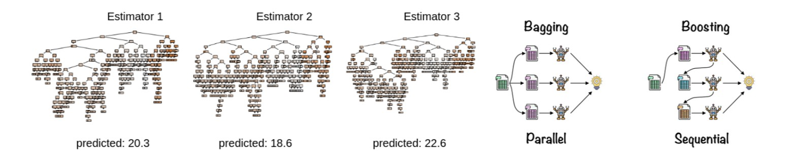

# Ensemble Learning - Bagging, Random Forests & Boosting  
Variance Reduction, Aggregation, Randomization & Exponential Loss Minimization

## 1. About

This notebook provides a comprehensive study of ensemble learning methods for supervised learning, focusing on how aggregation, randomness, and reweighting mechanisms improve generalization performance.

Rather than treating ensemble methods as black-box algorithms, the objective is to understand **why and when** they work, by combining theoretical analysis with controlled empirical experiments.

We explore:

- Model aggregation and majority voting
- Bias–variance decomposition and variance reduction
- Bootstrap sampling and random subspaces
- Probabilistic predictions from ensembles
- Boosting as exponential loss minimization
- Overfitting control through ensemble design

Both regression and classification settings are considered, using synthetic data as well as standard benchmark datasets.

## 2. Learning Problem Setup

We consider standard supervised learning problems.

### Regression  
Observations are pairs:

$$
(X_i, Y_i), \quad Y_i \in \mathbb{R}
$$

An ensemble predictor is built as a linear aggregation:

$$
\hat{F}(x) = \sum_{l=1}^{L} w_l \hat{f}_l(x), \quad w_l \ge 0
$$

### Classification  
Labels take values:

$$
Y_i \in \{-1, +1\} \quad \text{or} \quad Y_i \in \{1, \dots, K\}
$$

Predictions are obtained either by:
- majority vote,
- or aggregation of class probabilities.

## 3. Bagging — Aggregation and Variance Reduction

### 3.1 Theoretical Motivation

We first study majority voting under an idealized setting of independent classifiers, showing that aggregation improves accuracy when each classifier performs slightly better than random guessing.

This motivates the use of ensemble methods in practice.

### 3.2 Bagging with Decision Trees

Bagging (Bootstrap Aggregation) is implemented using regression trees with varying depths:

- decision stumps (depth = 1),
- moderately deep trees,
- highly flexible trees.

Through visualization, we illustrate:

- high bias of shallow trees,
- high variance of deep trees,
- variance reduction through aggregation.

### 3.3 Effect of the Number of Estimators

By varying the number of trees $L$, we show how increasing ensemble size stabilizes predictions without changing model bias.

## 4. Random Forests — Bagging + Random Subspaces

Random Forests extend Bagging by introducing randomness in feature selection at each split.

We evaluate Random Forests using cross-validation on several datasets:

- **Regression**: Boston, Diabetes  
- **Classification**: Iris, Digits  

Their performance is compared to linear SVM baselines.

We further analyze:

- probabilistic class predictions,
- uncertainty near decision boundaries,
- robustness to overfitting even with deep trees.

## 5. Boosting — Theory and AdaBoost

### 5.1 Exponential Loss and Bayes Optimality

We study Boosting from a theoretical perspective by introducing the exponential loss:

$$
\phi_{\exp}(z) = e^{-z}
$$

We show that minimizing the associated risk leads to a regression function:

$$
f^*(x) = \frac{1}{2} \log \frac{\eta(x)}{1 - \eta(x)}
$$

which induces the same Bayes classifier as the 0–1 loss.

This justifies the use of convex surrogate losses in Boosting.

### 5.2 AdaBoost Algorithm

We derive the AdaBoost weight updates and classifier coefficients by explicitly minimizing the empirical exponential risk.

The equivalence between different formulations of the weight update is demonstrated.

## 6. AdaBoost in Practice (Digits Dataset)

AdaBoost is applied to the Digits dataset using decision trees of varying depth.

We study:

- 6-fold cross-validation accuracy,
- training and test error as a function of the number of boosting iterations,
- the impact of base learner complexity.

Results show that:

- shallow trees lead to robust generalization,
- deeper trees reduce training error rapidly,
- overly complex base learners increase overfitting despite boosting.

## Bonus — Minimal AdaBoost Implementation

A minimal implementation of AdaBoost (SAMME variant) is provided to illustrate:

- sample reweighting,
- weighted weak learner training,
- ensemble aggregation by weighted voting.

This implementation focuses on clarity and pedagogy rather than optimization, and highlights the core mechanics of boosting algorithms.

## Core takeaways

- Bagging reduces variance through bootstrap aggregation.
- Random Forests improve robustness via feature randomness.
- Ensemble size controls stability, not bias.
- Boosting minimizes a convex surrogate of the 0–1 loss.
- Weak learners are essential for effective boosting.
- Model complexity must be controlled even in ensembles.
- Probabilistic predictions provide insight into uncertainty.
- Theory and practice align when losses are well chosen.

## Dependencies

- numpy  
- matplotlib  
- scipy  
- scikit-learn  

---

***Alexandre Mathias DONNAT***

