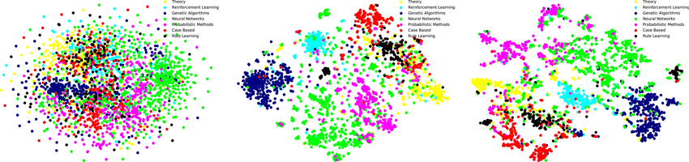

# Graph Machine Learning on the CORA Citation Network

**DeepWalk & Node2Vec - Graph Embeddings, Random Walks, and Node Classification**



## 1. About

This paper inplements a machine learning pipeline on graph-structured data, using the well-known CORA citation graph.

**The objective is to:**

- Load and analyze a r al citation network
- Compute structural descriptors of the graph
- Construct node embeddings using graph-based random walks
- Train a classifier to predict paper categories
- Compare DeepWalk and Node2Vec, two foundational methods in graph representation learning

## 2. Dataset Description — CORA Machine Learning Papers

This directory contains a selection of the Cora dataset ([www.research.whizbang.com/data](http://www.research.whizbang.com/data)).

The corpus contains Machine Learning scientific papers, categorized into seven classes:

- `Case_Based`
- `Genetic_Algorithms`
- `Neural_Networks`
- `Probabilistic_Methods`
- `Reinforcement_Learning`
- `Rule_Learning`
- `Theory`

### Dataset Characteristics

- **2,708 papers** (nodes)
- Each paper cites or is cited by at least one other
- **Vocabulary**: 1,433 binary word features (after preprocessing)
- Words with frequency < 10 removed

### Files

#### `cora.content`

**Format:**
```
<paper_id> <1433 binary attributes> <class_label>
```

Each paper is represented by a bag-of-words binary feature vector, followed by its class.

#### `cora.cites`

**Format:**
```
<cited_paper_id> <citing_paper_id>
```

Defines a directed edge: **citing → cited**

Thus, CORA forms a directed graph $G = (V, E)$ with $|V| = 2708$, $|E| = 5429$.

## 3. Mathematical Foundations of the Project

This section introduces the mathematical objects underlying the DeepWalk and Node2Vec pipelines.

### 3.1 Graph Definition

We model the citation structure as a directed graph $G = (V, E)$ where:

- Each node $v \in V$ represents a paper
- Each edge $(u \to v) \in E$ represents a citation

The adjacency matrix $A \in \{0, 1\}^{|V| \times |V|}$ satisfies:

$$A_{uv} = 1 \text{ iff } u \to v \text{ is a citation}$$

We also have a feature matrix $X \in \{0, 1\}^{2708 \times 1433}$ of binary word indicators.

### 3.2 Centrality Measures

For each node, we compute:

- **Degree centrality:** $\deg(v) = \sum_u A_{vu}$
- **Closeness centrality:** $C(v) = \frac{1}{\sum_u d(v, u)}$
- **Eigenvector centrality** (principal eigenvector of $A$): $x = \lambda A x$
- **Betweenness centrality:** ratio of shortest paths passing through a node

Each centrality highlights a different structural notion (popularity, accessibility, influence, bridging).

## 4. DeepWalk: Mathematical Intuition

DeepWalk converts a graph into a corpus of "sentences" using random walks, and then learns embeddings via Skip-Gram Word2Vec.

### 4.1 Random Walks on Graphs

Given a starting node $v_0$, a random walk of length $L$ is a sequence:

$$(v_0, v_1, \ldots, v_L)$$

where $v_{t+1} \sim \text{Uniform}(N(v_t))$ and $N(v_t)$ is the neighborhood of $v_t$.

Repeated random walks approximate the stationary distribution of the graph and encode local topology.

### 4.2 Skip-Gram Word2Vec Objective

Given a sequence of nodes from random walks, DeepWalk maximizes:

$$\sum_{v \in V} \sum_{u \in \text{Context}(v)} \log p(u \mid v)$$

with the Skip-Gram model:

$$p(u \mid v) = \frac{\exp(z_u^\top z_v)}{\sum_{w \in V} \exp(z_w^\top z_v)}$$

Optimized via negative sampling.

DeepWalk embeddings therefore approximate a matrix factorization of a high-order proximity matrix.

## 5. Task 1 - DeepWalk Class Implementation

We implement:

- Random walk generator
- Walk corpus generator
- Word2Vec training
- Optional t-SNE visualization

The class outputs an embedding matrix:

$$Z_{\text{DW}} \in \mathbb{R}^{2708 \times 32}$$

representing each node in a continuous vector space.


## 6. Task 2 - Node Classification Using DeepWalk Embeddings

We treat the embeddings as features:

$$X = Z_{\text{DW}}, \quad y = \text{subject labels}$$

and train a Random Forest classifier.

**Rationale:**

- Graph embeddings encode structural similarity
- Classifier tests whether representations are discriminative
- Random Forest handles nonlinear class boundaries well

**Achieved accuracy ≈ 84%**, showing strong structural signal in the citation network.

## 7. Task 3 - Node2Vec Embeddings and Final Comparison

Node2Vec generalizes DeepWalk by introducing biased random walks, controlled by:

- Return parameter $p$
- In–out parameter $q$

The transition probability is:

$$P(v \to x) \propto \alpha_{pq}(t, x) \cdot w_{vx}$$

with bias function $\alpha_{pq}$ selecting BFS-like or DFS-like exploration.

Node2Vec explores:

- **Homophily** (similar nodes)
- **Structural equivalence** (similar roles)

We compute embeddings:

$$Z_{\text{N2V}} \in \mathbb{R}^{2708 \times 32}$$

Then:

- Visualize via t-SNE
- Classify using Random Forest
- Compare accuracy vs DeepWalk

### Typical Results

| Method    | Accuracy |
|-----------|----------|
| DeepWalk  | 0.843    |
| Node2Vec  | 0.838    |

With $p = q = 1$, Node2Vec ≈ DeepWalk.

## 8. Mathematical Insight from the Comparison

Both DeepWalk and Node2Vec approximate a spectral factorization of multi-step random-walk matrices.

When $p = q = 1$, transition probabilities revert to simple random walks → the methods become nearly equivalent.

Node2Vec becomes meaningfully different when exploring:

- Local neighborhoods (BFS bias)
- Structural roles (DFS bias)

Thus classification performance converges when $p$ and $q$ are neutral.

## 9. Dependencies

- `networkx`
- `scikit-network`
- `gensim`
- `node2vec`
- `scikit-learn`
- `matplotlib`
- `seaborn`
- `pandas`
- `numpy`

---
**Alexandre Mathias DONNAT, Sr**
